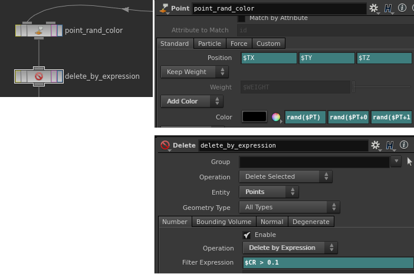
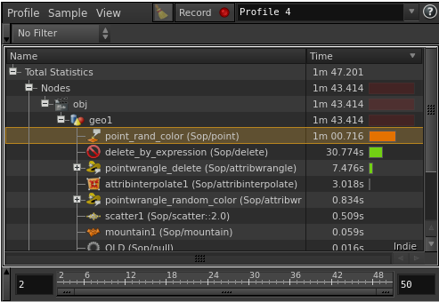
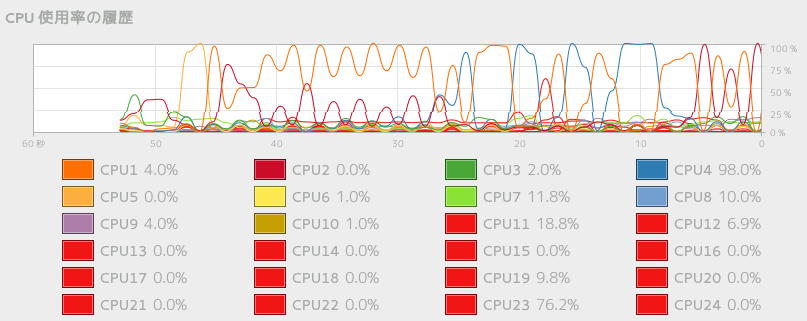
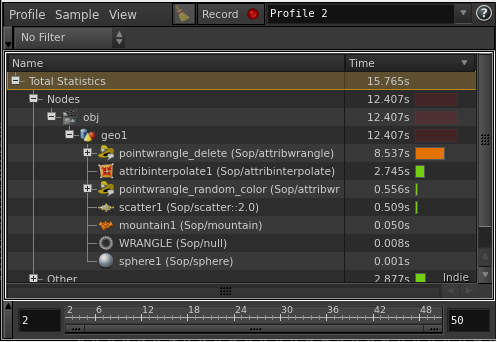
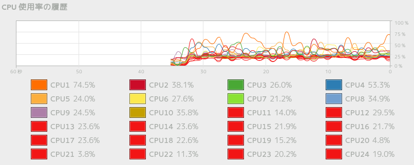
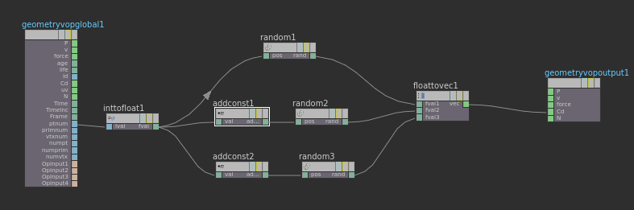
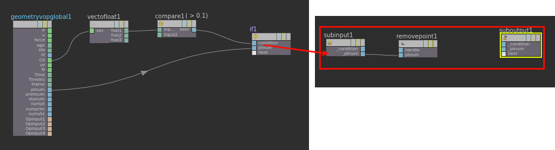
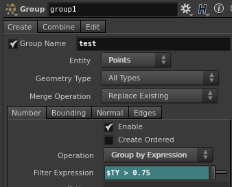
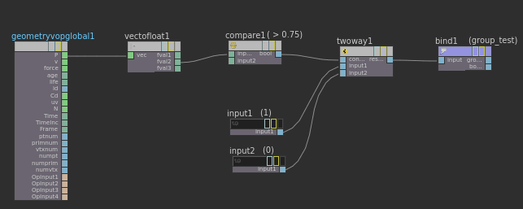
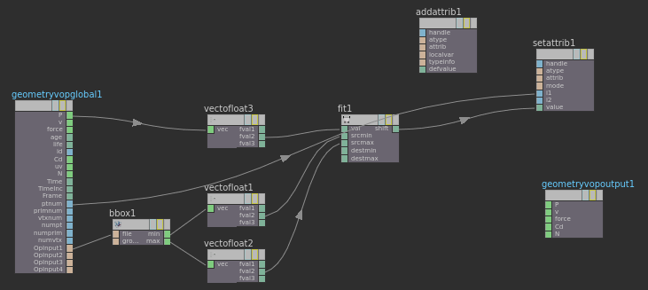

Wrangle has been included since 12.5, but I feel many people are avoiding it or scaring.

Maybe you' re avoiding it because it reminds you of Maya's Expression, which is frustrating. But people had used Maya will be familiar with it because vex is similar to Expression. And I believe all FX artists can do some coding, such as Python and Mel.. Definitely, this knowledge will help you. So don't be scared.


The main reason I recommend you is fast. That's it. You might be seen such an expression, `$CR>0.2`, in the beginner's tutorials. This is very slow because it is done in a single-threaded.
In my opinion, we often see Point Sop in tutorials, but We will no longer use it.
Vop and Wrangle can work in multi-threads, so these are FAST!

Probably someone says, "That's enough with Vop.", but Wrangle will be easier to use than it in some situations. It's worth remembering. Trust me.

OK, let's make a comparison between old-method and wrangle!


## Comparison 

Create one million points on the sphere using Scatter SOP. And add random color for it. Finally, delete some points if it has a bigger red value than 0.1.

Old method..,


It took one minute 47 seconds for 50 frames.


Checked the CPU, some core was not used.


<br>

Let's replace it with the wrangle. The code of the setting random color will be like this:
```c# {linenos=false}
v@Cd = set(rand(@ptnum), rand(@ptnum + 0.123),rand(@ptnum + 1.234));
```

Removing the points:
```c# {linenos=false}
if(@Cd.x > 0.1)
    removepoint(geoself(),@ptnum);
```
It took only 16 seconds. It's fast.


All CPU was doing the work.


By the way, you can create a same system in VOP.
Creating random color:


Removing the points:


Doesn't Wrangle look easier? The cooking speed of VOP and Wrangle are almost the same in this case.


## Bounus

Let's replace some other SOPs with Wrangle.

##### Create a group under a particular condition
  
  - Group SOP

    

  - Wrangle

    ```c# {linenos=false}
    if(@P.y > 0.75)
      i@group_test = 1;
    ```

  - Vop

    

##### Create an attribute

Create a new value from Position Y, remapping it to 0-1.
  
  - Attribute Create

    With expression

    ```bash {linenos=false}
    fit($TY,bbox(opinputpath(".",0),D_YMIN),bbox(opinputpath(".",0),D_YMAX),0,1)
    ```

  - Wrangle
    ```c# {linenos=false}
    vector min_p;
    vector max_p;

    getbbox(0,min_p,max_p);

    f@check = fit(@P.y, min_p.y, max_p.y, 0, 1);
    addvariablename(0,"check","CHECK");
    ```

  - Vop

    


## Conclusion

You might not know how to do the same thing with Vop in Wrangle. But you can get a cheat sheet after you create a system in vop and select `View Vex` from right-crick on that node.

In profecinal work, since I often pass scene files and setups to others, I'm careful about some things. I try to separate nodes for each function because I am sure dozens of lines in a one Wrangle node would be detestable.

Since Flip particles have millions and millions of points, you need to use Wrangle and Vop a lot. 

Check which part has heavy calculations on your setup using the Performance Monitor. Then replace with Wrangle to experience the difference in speed.

Sample scene is here.(Houdini14.0.201.13-gcc4.8  Fedora20)

[Download](wrangle_01.hiplc)