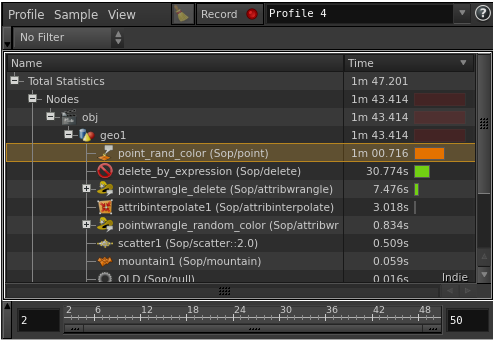
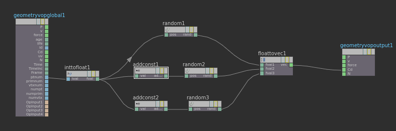
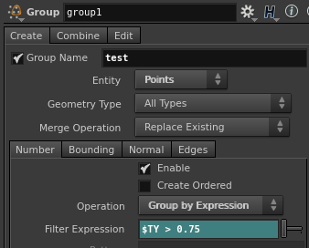
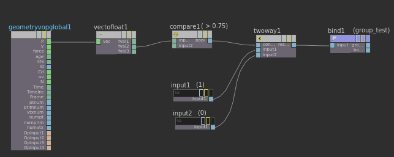

12.5から搭載されたWrangleですが、結構避けてる人が多い印象です。

せっかくノードベースでやってるのに、~~イライラする~~MayaのExpressionを思い出させられて避けてるのかもしれません。

しかしMayaから移行した人にとっては、Expressionと似ているので敷居は高くないはずです。エフェクト屋でPythonとかMelなどのScriptを、全く書けないという人はいないと思うんで、その知識も役立ちます。
<!--more-->

 
お勧めする理由は、単純に速いの一言につきます。初心者向けのチュートリアルでよく出てくる、`$CR>0.2`みたいなExpressionを使うやつが重いです。なぜ遅いのか、ざっくり言うとシングルスレッドだからです。
個人的な意見ですが、チュートリアルでPoint Sopを使ってるのをよく見かけますが、もはや使うことはありません。Attribute Createもほとんど使わないです。理由は遅いからです。VopとWrangleは、ざっくり言うとマルチスレッドで速いからです。

別にVopでいいじゃんと思う人もいるかもしれせんが、Wrangleの方が簡単に済ませられる時もあるので、覚えておいて損はないです。


では、どんだけ違うか検証してみましょう。


## 検証

SphereをScatterして100万ポイント作ります。ポイントにランダムなカラーをつけて、赤が0.1より大きいポイントを消すことにします。

従来？の方法の場合


50フレームで1分47秒かかります


CPUをみてみると、使ってないコアがあるのがわかります。


<br>

これらをWrangleで置き換えてみます。Wrangleでランダムな色をセットする際は
```c# {linenos=false}
v@Cd = set(rand(@ptnum), rand(@ptnum + 0.123),rand(@ptnum + 1.234));
```

ポイントを消すには
```c# {linenos=false}
if(@Cd.x > 0.1)
    removepoint(geoself(),@ptnum);
```
16秒で計算されました。速いですね。


CPUはすべて使ってます。


ちなみに、Vopで組むとなると、こうです。
ランダムな色を作るには


ポイントを消すには


Wrangleのほうが簡単に見えませんか？このケースではVopとWrangleの速度は、ほとんど変わりません。


## おまけ

さらに、他のSopもWrangleで置き換えてみましょう。

##### ある条件のもとでグループを作りたいときは
  
  - Group SOP

    

  - Wrangle

    ```c# {linenos=false}
    if(@P.y > 0.75)
      i@group_test = 1;
    ```

  - Vop

    

##### アトリビュートを作りたいときは

Yの位置で新しい値を作って、Yの最大値を1に最小値を0にマッピングします。
  
  - Attribute Create

    エクスプレッションをかくなら

    ```bash {linenos=false}
    fit($TY,bbox(opinputpath(".",0),D_YMIN),bbox(opinputpath(".",0),D_YMAX),0,1)
    ```

  - Wrangle
    ```c# {linenos=false}
    vector min_p;
    vector max_p;

    getbbox(0,min_p,max_p);

    f@check = fit(@P.y, min_p.y, max_p.y, 0, 1);
    addvariablename(0,"check","CHECK");
    ```

  - Vop

    


## まとめ

Vopで組めるけど、Wrangleで書くときはどーすればいいか迷うことがあると思いますが、そんな時はVopで組んでからノードを右クリックしてView VEXを実行すれば、カンペを見ることができます。

仕事で使うときは、シーンファイルやセットアップを他の人に渡すことが多いので気をつけてることがあります。1つのWrangleノードに何十行もかいてしまうと、嫌がられること間違いないので、機能ごとにノードを分けるようにしています。（ただ、自分の場合Sop自体のノード数が多すぎて嫌がられることが多々ありますがｗ）

Flipは何百万何千万ものPointを編集するので、WrangleとVopを多用する必要があります。一回、あなたが組んだ仕組みをPerformance Monitorでみてみましょう。どこが負荷をかけているかが分かります。そしてWrangleを使って速度の違いを体感してみてください。

シーンファイルはこちらです。(Houdini14.0.201.13-gcc4.8  Fedora20)

[ダウンロード](wrangle_01.hiplc)