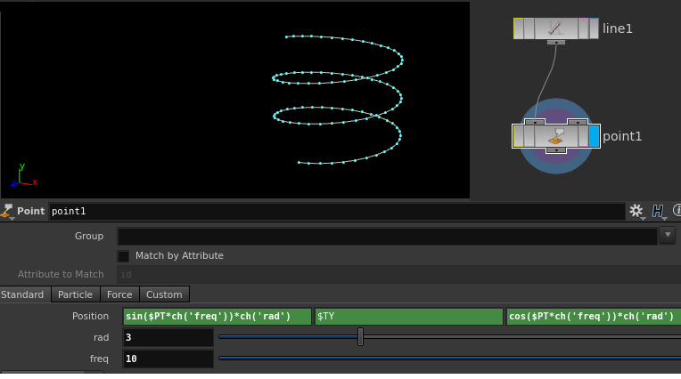
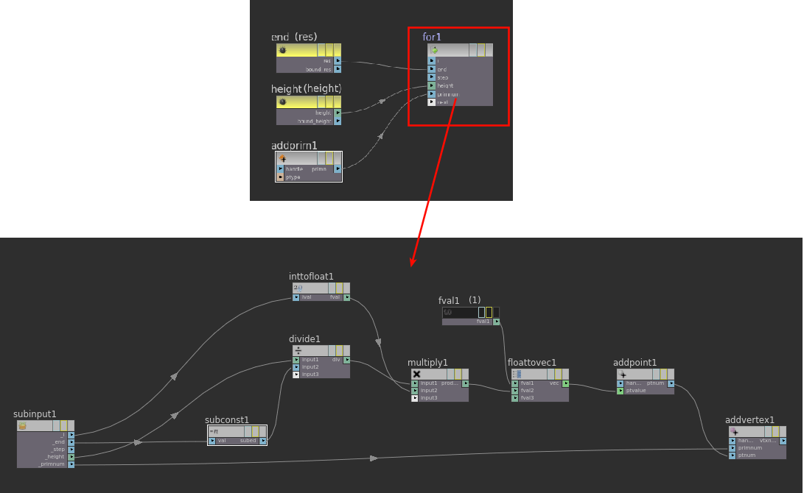

Wrangle is not to only create/edit attributes. It can make new points/primitive as well.

Wrangleは、アトリビュートを作ったり編集するだけでなく、Pointを作ったりPrimitiveを作ったりもできます。初心者向けのチュートリアルで時々みるPointSopを使って、Pを編集してるやつをWrangleで置き換えてみます。こんなやつです。



まずラインの作り方
line sopできますが、wrangleでやってみます。ただの直線を作るときに、わざわざwrangleでやる必要はないかと思いますが、近くのpoint同士を結びつけるときなど普通にやろうとすると、めんどくさい時に重宝するので覚えときましょう。


```c# {linenos=false}
int res      = 10;
float height = 5.0;
int line = addprim(0, "polyline");

for(int i=0; i<res; i++){
    vector pos =set(1, height/(res-1)*i, 0);
    int cp = addpoint(0,pos);
    addvertex(0, line, cp);    
    }
```

長さ(height)とポイント数(res)を決めてあげて、これらのポイントを結んでラインを作ります。なぜ、Vertexを作る必要があるかというと、Primitiveを構成するにはVertexが必要です。Pointではありません。[Help: ジオメトリの作成](https://www.sidefx.com/ja/docs/houdini/vex/snippets.html#%E3%82%B7-%E3%82%AA%E3%83%A1%E3%83%88%E3%83%AA%E3%81%AE%E4%BD%9C%E6%88%90)

もちろん、Vopでもつくれます。


ラインが作れたら、各Pointの位置を編集するだけです。簡単ですね。

```c# {linenos=false}
int   res    = 100;
float rad    = 3;
float height = 5;
float freq   = 10;

int line = addprim(0, "polyline");

for (int i = 0; i < res; i++){
    
    vector pos;
    
    pos.x = sin(radians(i) * freq) * rad;
    pos.y = height / (res-1) * i;
    pos.z = cos(radians(i) * freq) * rad;
    
    int cp = addpoint(geoself(),pos);
    addvertex(0, line, cp); 
    }
```

1つ気をつけないといけないのは、エクスプレッションのsin/cos/tanは**Degree**、Vexは***Radian***なので変換が必要です。

---

sine, cosine, tangent, dot product, cross product,etc...
この業界に入って思うことは英語、数学、物理学、英語、英語とか色んな知識が必要です。専攻していた分野が、この業界とは全く関係ないとはいえ、学生時代なにしてたんでしょうね(T_T)
今まで働いてきた会社には多くの優秀な外人がいました。日本人の優秀な人より、基礎がしかっりしているなとよく感じました。（日本では専門学校でソフトの使い方を軽く教わるだけが大半という時点で差がついてしまってるかもしれませんね。）
彼らは基礎知識がしっかりしてる上に最新の技術も積極的に取り入れています。そして、なにより勉強熱心です。この差を詰めるのは大変です。

日本人でも外人でも、尊敬できる優秀な人に共通してることは、30過ぎても年齢など関係なく勉強を怠らない人たちです。日々勉強ですね。

話はそれましたが、[Expression Cookbook](https://www.sidefx.com/ja/docs/houdini/ref/expression_cookbook.html)に、いくつかExpressionの例があるので、Wrangleに置き換えてみてください。
三角関数を使って[色んな形](http://www.nano-architects.com/curves.html)を作れるので、面白いですよ。

---

シーンファイルはこちらです。(Houdini14.0.201.13-gcc4.8  Fedora20)

[ダウンロード](wrangle_02.hiplc)

次は、もうちょい絵的にFXっぽいネタにします。