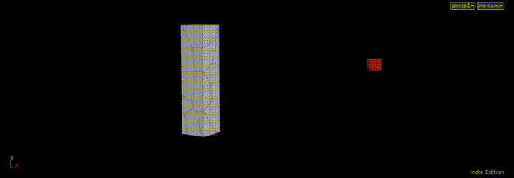
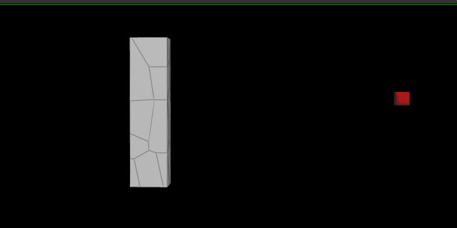
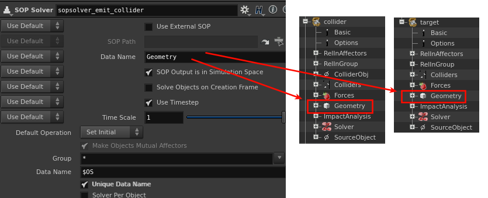
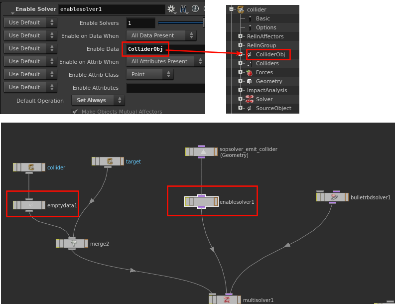
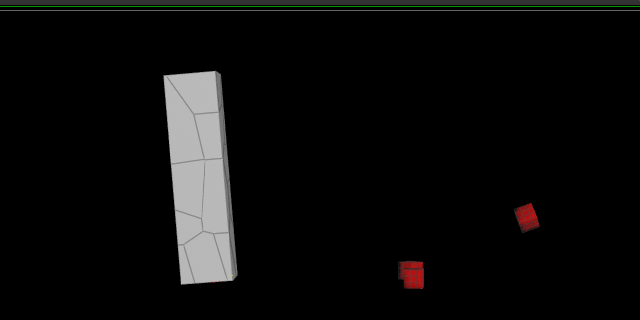
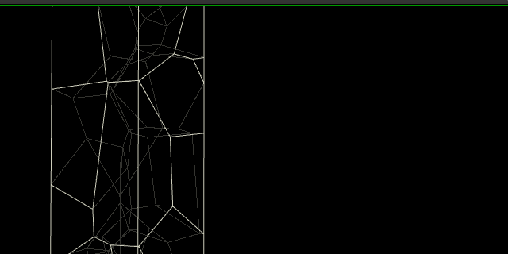
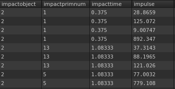
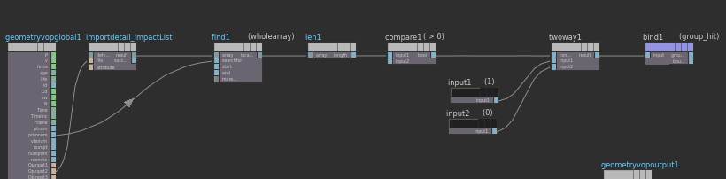
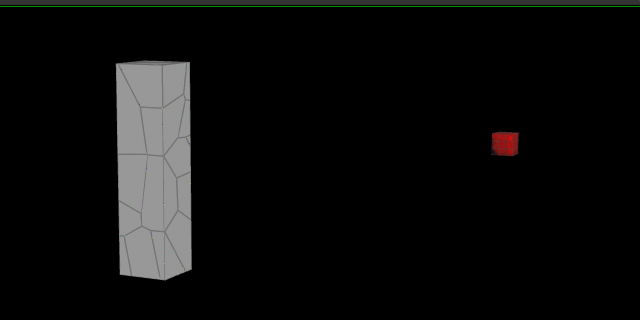
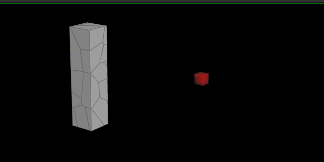

FXらしく少し見栄えの良いものを紹介します。

破壊です。といっても、激しいやつではありません。



破壊をするときは、Pre-Fractureしてからシミュレーションをかける事が大半だとも思いますが、何かしらのトリガーによって自動的に破壊が起こる仕組みを作ってみます。

---

今回のトリガーさんはImpactです。何かしらが対象物に当たり、ある一定以上の衝撃を受けた部分を壊していきます。
（昔からshelfにRBDで似たようなのができるボタンがあったと思いますが、使ったことないのでよく知りません。）

簡単なところやパラメータに関しての説明はしませんので、hipファイルを見ながら、ブログを読んでいただけるとありがたいです。

[**シーンファイル**](dynamically_fracturing_blog.hiplc)(Houdini14.0.291-gcc4.8  Fedora20) 


そもそもRBD Packed Objectを使ったことない人は、これからの説明を理解することは困難だと思うので、日本語字幕も付いている[**H13 Masterclass | Bullet**](https://www.sidefx.com/ja/tutorials/h13-masterclass-bullet/)を見ることをおすすめします。


## Emit Pack Objects
このチュートリアルの19:30くらいからのPackエミットを使って、破壊を引き起こす飛んでくる物体をつくります。しかし、チュートリアルのままだと、エミットの量が倍になってしまいます。この問題は、RBD Packed Objectが複数あると起こっていしまいます。



上の画像のように白い柱と赤いボックスは、別々のRBD Packed Objectです。この2つがGeometryというデータを持っているため、SopSolverが両方に処理を行ってしまいます。なのでエミットの量も2倍になっています。




問題を解決するには、片方だけに処理が行われるようにしなければいけません。
[Empty Data DOP](https://www.sidefx.com/ja/docs/houdini/nodes/dop/emptydata.html)で任意のDataを作り、[Enable Solver DOP](https://www.sidefx.com/ja/docs/houdini/nodes/dop/enablesolver.html)で作ったDataに対してのみ作用するようにします。(~~ここの使い方が正しいかは、あまり自信がないです~~)




これで意図する結果が得られました。



## Get Impact Attributes

続いて、Impactの情報を取得するために、[Impact Analysis DOP](https://www.sidefx.com/ja/docs/houdini/nodes/dop/impactanalysis.html)を使います。これはImpactの時間や強さ、法線、ぶつかったオブジェクトのOBJID等を取得できます。



このImpactの情報を元にFractureしていきます。
 初めに衝撃を受けたピースの判定をします。Impactの情報の中には`impactobject`と`impactprimnum`があります




`impactobject`は$OBJIDのことで、`impactprimnum`はPackのPrimitive Numberです。
このimpactprimnumをArrayアトリビュートに格納します。

```c# {linenos=false}
int numpoints = npoints(0);
i[]@_impactList;

for(int i=0; i<numpoints; i++){
    int prinum = point(0,"impactprimnum",i);
    append(@_impactList,prinum);
    }
```

Arrayの中に重複した値がある場合がありますが、今回は問題にならないので無視します。
H14からArrayをアトリビュートに保存できるようになりましたが、すごい便利ですね。




Vopを使ってprimnumがこのArrayの中にある値と同じときに、任意のGroupに入るようにしています。




## Dynamic Fracturing
後は、このGroupに入ったピースをUnpackして壊してくだけです。

砕いた後に、packed objectに戻しますが、nameアトリビューを重複しないように修正します。nameはコンストレイントでは必ず使用されるので注意して扱う必要があります。また、RBD Packed Objectの中にあるcreate_or_overwrite_attributesをみてシミュレーションに必要なアトリビュートを設定しておきましょう。最後に、砕く前のvなどのアトリビューを移しておくと、それらの値を継承したまま新たな破片が生まれることになります。




このままだと無限に割れ続けてしまうので、ある一定の状態になったものは割れないようにしといたほうが良いです。例えば、ピースがある一定以下のサイズになった場合とか、割れる最大回数を指定しておくとかです。

さらにコンストレインを毎フレーム更新すると、より見栄えが良くなっていくと思います。最初のムービーはPin Constraintを毎フレーム生成しています。
 ~~書くの疲れてきたしGW中なので~~諸事情により、これらの説明等は割愛させていただきます。

---

Packが登場して格段にDopでのコントロールが簡単になりましたね。ほぼSopです。Details Viewを見ながら値を簡単に確認しながらできるので楽です。
色んな人に言っていますが、重要なのはSopです。今回、Dopを使ってますが、ほとんどの作業はSopです。Sopを制するものはHoudiniを制するとまでは言いませんが、それくらい重要です。