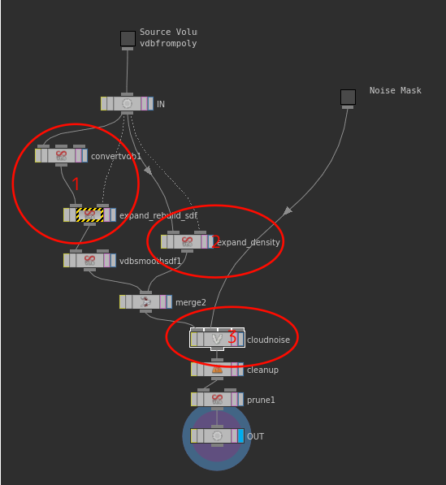
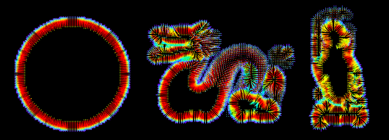
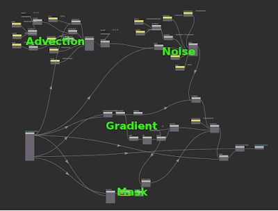
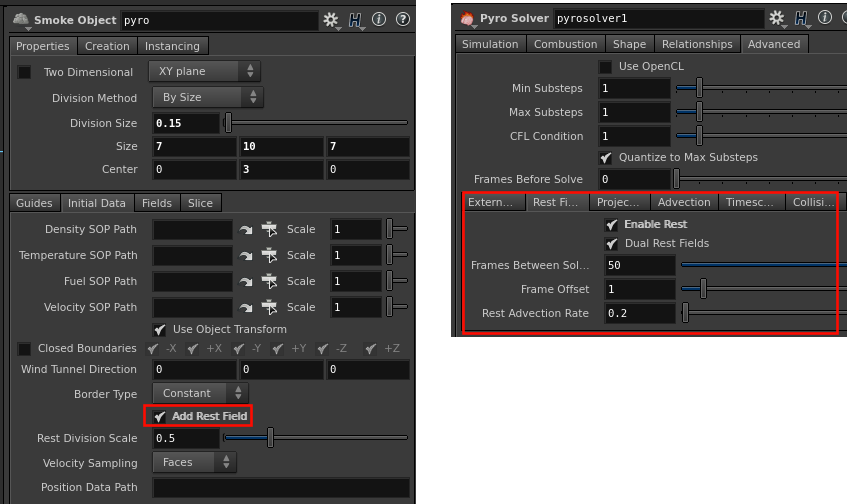
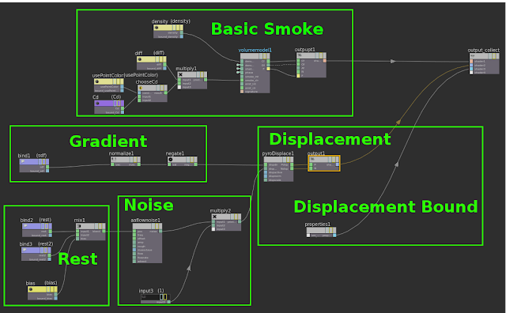
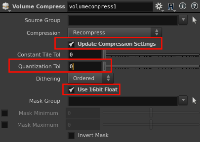
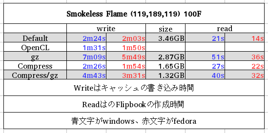
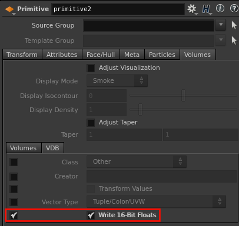

## Cloud Noise

シミュレーションをせずにVolumeを何かしら編集するエレメントといったら雲や霧だと思います。

エフェクトの人で雲を作るときに、ネット検索で引っかかり一回は目にしたことであろう、この論文[http://magnuswrenninge.com/productionvolumerendering](http://magnuswrenninge.com/productionvolumerendering), [Resolution Independent Volumes](https://people.cs.clemson.edu/~jtessen/reports/papers_files/RIV.pdf) 何やら、難しそうですね。てか4年(2011)も前なんですね。

個人的な見解ですが、H13?から用意された[Cloud Noise Sop](https://www.sidefx.com/ja/docs/houdini/nodes/sop/cloudnoise.html)はこれを元に作られていると見ています。理由は中を見ればわかります。

Surfaceの場合、DisplacementはNormal方向に対して、ポジションをオフセットします。となると、VolumeのNormalを計算する必要があります。つまりGradientを用意します。

1. Density VolumeをPolygonにしてからSigned Distance Field(SDF)を作っています。SDFは表面までの距離を記録しています。これをVolume Vopで[Volume Gradientを](https://www.sidefx.com/ja/docs/houdini/nodes/vop/volumegradientfile.html)使って読み込んだSDFから勾配を計算し、このVector方向にDisplacementしています。	SOPでも[VDB Analysis](https://www.sidefx.com/ja/docs/houdini/nodes/sop/vdbanalysis.html)か[Volume Analysis](https://www.sidefx.com/ja/docs/houdini/nodes/sop/volumeanalysis.html)を使って勾配のVector Fieldを作れます。

	

2. DisplacementによってVolumeが膨らむことを考慮して、2でBounding Boxを大きくしています。

3. Noiseを生成しています。
	

	NoiseはForを使って、最初のNoiseより少し小さなNoiseを足していくようなことを繰り返すことによって複雑なNoiseを作り出しています。あとはAdvectionもありますね。

	論文で紹介されているやり方に似ていると思いませんか？

	中を覗いてみることによって、細かいところは理解できなかったとしても、VolumeにDisplacementする大枠はつかめたのではないでしょうか？
	SDFからGradientを計算し、その方向にNoiseで作った値をDisplacementするという流れです。次に、この考えを応用してみます。

## Pyro Displacement



VolumeのDisplacementの方法がわかったところで、続いてシミュレーションしたVolumeに対しての方法を紹介します。

前述の方法は静止しているPに対してNoiseをかけていました。今回は シミュレーションされたVolumeに対して処理を施します。PにNoiseをかけると煙の動きとあいません。Maya Fluidだと煙の進行方向と動きのスピードに合わせて、Noiseのオフセットにキーを打つみたいなことをした経験があるかたもいるかもしれませんが、そんなことはしません。

restが必要です。他のソフトではP_refとか言われていますね。

rest Filedを作るにはいくつか設定が必要です。[Smoke Object](https://www.sidefx.com/ja/docs/houdini/nodes/dop/smokeobject.html)と[Solver](https://www.sidefx.com/ja/docs/houdini/nodes/dop/smokesolver.html)に設定すべき項目があるので設定します。

ヘルプによるとRest Fieldは、流体の位置を追跡するフィールドと解説されています。また、Dual Restは長いシミュレーションの時に有効で、異なる開始フレームで始まる2つのrestができて、その2つをブレンドして使います。そして、Detailアトリビュートにrest_ratioとrest2_ratioの2つが追加されます。VopまたはShader内で読むときは、restとrest2をMixでまぜbaisにratioを入れてあげます。

最後にSDFも用意しておきましょう。

ここまで用意できれば、後はrestを元にNoiseを作ってDisplacementするだけです。SOPでやるかShaderでやるかは、アナタ次第です。

ちなみにShaderでやる場合は、Pyro Shaderを参考にすると良いです。
上の動画はBasic Smokeを元に作りました。

[How to set rest(hip)](rest_ratio.hiplc)

## おまけ。Compress Volume Cache

とあるセミナーで、キャッシュサイズの節約法みたいな話がでていたみたいなんで、ここでも触れてみたいとおもいます。といっても、これまた用意されているOTLとノードの解説なんで、手抜き感が否めないですが、意外と知らない方が多いので紹介します。

ShelfからPyroを組んでる人は、Dop I/O SOPを使ってキャッシュをとってる人がいるかもしれません。そのSOPにCompressionタブがあり、これを使います。これはVolume Compressノードの値を逃しているだけです。
 このノードは基本的に、以下の画像の赤枠をいじればよいかと思います。Compress設定は、レンダリングに影響が出ない範囲で、最適な値を各自見つけてください。

 

 ちょうど2年前に比較したデータですが、Compressをすることでサイズが半分くらいになり、ディスクへの書き込み時間も減っています。
 
 余談ですが、この表はWindowsとLinuxを比べることを目的にしたものです。どちらが速いかはわかりますよね。

また、多くのVolumeなんちゃらSOPはVDBに対応していません。VDBのデータを16bitにしたい場合は、PrimitiveのVolume>VDBにWrite 16-Bit Floatsというオプションにチェックを入れます。

 

 ## まとめ

今回の内容は、SideFxが用意したOTLの解説みたいになってしまいました。Houdiniのアセットは、ブラックボックスになっているところが少ないので中の仕組みを見ることも、編集して自分用にカスタマイズできます。当たり前ですが仕事で使うには、遅かったりコントロールが難しかったり、クオリティが出にくいことがあるので、中を見たり編集する行為は必然です。

Sigrapphのようなところで発表された技術も、Cloud Noise Sopのように既存のノードを組み合わせるだけで一部を再現できることがあります。Mayaやプラグインのアップデートを待たないと何もできないと手をこまねいているより、新しい技術を観て取り入れるチャレンジをすれば色んな発見をし、可能性が広がるかもしれません。
