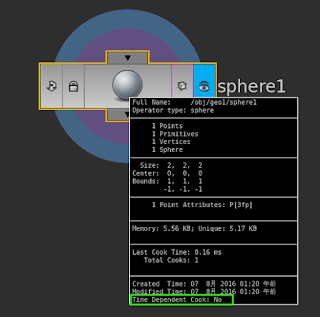
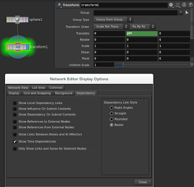
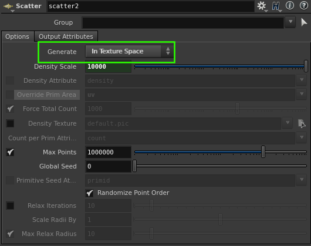
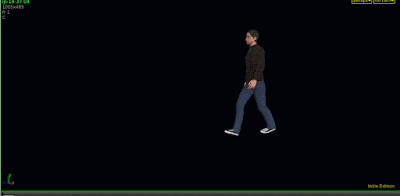
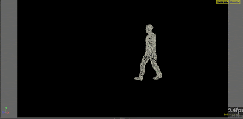
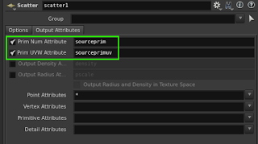
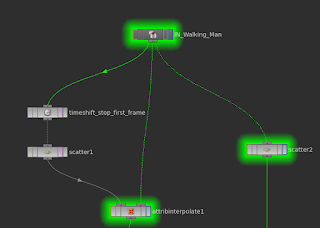
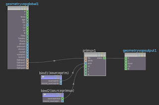
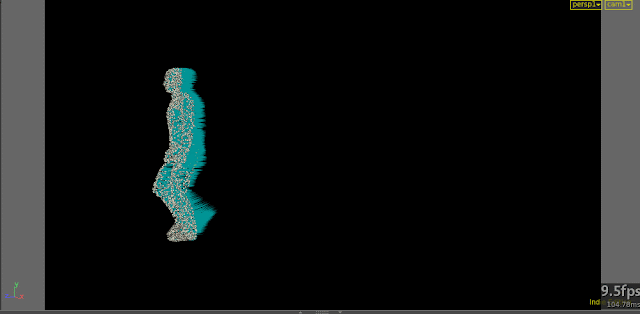
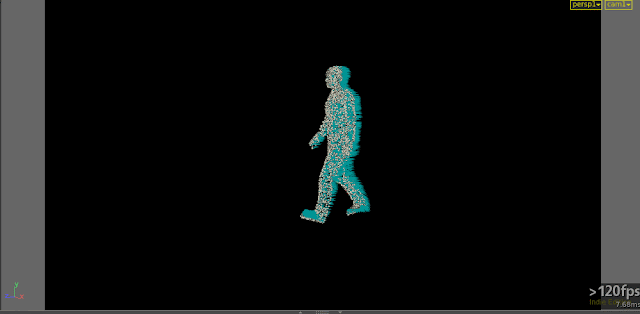

お久しぶりです。そこそこ忙しくて、ブログを書くのを怠ってました。
今回の内容はビギナー向けですが、非常に重要な考え方なので紹介しようと思います。Time Dependent Cookについてです。

Time Dependentという言葉は、Houdiniを使ってないと聞き慣れないかもしれませんし、気にしたこともないかもしれません。

[サンプルファイル](fxhack_TimeDpendentCook.hiplc) (Fedora21, Houdini15.0.393, linux-x86_64-gcc4.8)

## What is Time Dependent？

ではTime Dependentとはなんでしょうか？直訳すると「時間に依存」です。

[Time Dependent Cook:Yes]はフレームが変わるとcookする。逆にNoの場合は、 1回cookすれば、それを使いまわします。単純な話、レンジが100Fの場合でYesなら100回cookします。Noなら1回のcookですみます。

これを気にせずアセットを作るなんてことは、トーシロー、素人です。一昨日来やがれ。言い過ぎました。

このTime Dependent Cookの情報をどうやって知るかというと、ノードをミドルクリックすれば一番下に出てきます。SOP、DOP、OBJ、COP、CHOP、SHOP、ROP全てのノードで出てきます。（ん？ROPのTime Dependent Cookってなんでしょうね？）

また、会社の人に教えてもらいましたが、ノードを光らせてどのノードがそうなのかを識別させることもできます。

## どうして重要なのか？

続いて、活用方法を紹介したいと思います。Houdini始めたら誰しもが使うScatterを使って解説します。

例えば、この歩いている人間にPointを発生させたいとします。普通にScatterすると毎フレーム違う場所に発生してしまいます。これを回避するには、ScatterのパラメータにあるGenerateをIn Texture Spaceにします。一気に処理が重くなりますね

パラメータを変えるまでは120fps出ていたのに、 10fpsも出なくなってしまいました。致命的ですね。

速くするにはScatterするのを1回だけにして、後からPositionを動かせばいいのです。TimeShiftでScatterのソースを止めます。そして、ScatterのOutput Attributesから2つを有効にします。これはScatterしたPrim NumberとUVを保存してくれます。

保持したら、最近ついた新しいノードをつかいます。Attribute Interpolateです。1st InputにScatterしたPointをさして、2nd Inputに動いてる人をさすだけPointが動きます。

Attribute Interpolateなかったころ、どうやっていたかというとVopのPrimitive Attributeを使っていました。ちなみにですが、sourceのPrim NumとUVはIntersect Vopでもとれます。

Pointが動いたということで、どれくらい速くなってか試してみましょう。一番最後にTrail Sopをさして、Compute Velocityをvを計算させてみます。毎フレームScatterする場所が違うと、vもおかしな値が入ってしまうので、正確に動作しているかも判断できます。

では、Scatterを毎フレーム計算させた場合です。

続いて、1FだけScatterしたものです。

一目瞭然ですね。処理も速いですし、Velocityもうまく計算されています。

Attribute Interpolateを使うと速くなるよということが言いたかったわけではありません。何が言いたかったかというと、重い処理を極力少なくすれば速くなるよということです。

それを判断する材料の1つがTime Dependent Cookということです。

特になにかしらのエミッターを作るときに、非常にお世話になります。シミュレーションは重いです。エミッターも重いとなるとトライアンドエラーの回数が減ってしまいます。

## まとめ

出来る限り重い処理を少なくするためにはどうすればよいか。

今回の例だとに変えました。言葉の並び替えみたいなようなものですが、この考え方が重要です。頭の中で、今ある仕組みを文にして、並び替えてみてください。

ただ単純にノードをつなぐ順番を変えるだけでも、速くなるかもしれません。Performance MonitorやTime Dependentを表示させて、どこがネックになっているか見てみましょう。

今作っている仕組みには、これ使えないなと思ってるあなた！本当にそうでしょうか？固定観念を捨てて、違った角度から考えてみてはいかがでしょうか？なぜなら、あなたが使ってるソフトはHoudiniなんです。限界を作ってるのはあなた自身かもしれません。信じるか信じないかはアナタ次第です！笑