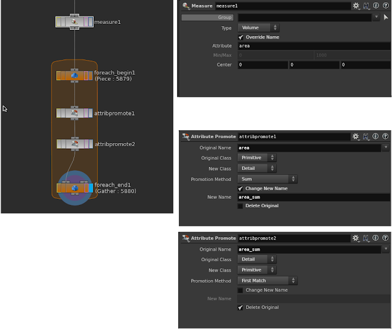

<!--  -->


久しぶりのWrangle回です。

個人的にHoudiniにおいて、よく使う必需ノードは、For LoopとAttribute Promoteです。これらがないと仕事ができません。もちろんWrangleも絶対使います。

特にFor LoopはHoudiniを象徴するようなノードだと勝手に思ってます。ある処理を考え、それを他のものにも同様な処理を施す。まさにProceduralに作業する上で必要不可欠なものです。

しかし！ForLoopは処理に時間がかる時が大半です。なぜなら、。

---

シンプルな例を元に解説していきます。

Sample File : [wrangle_03.hiplc](wrangle_03.hiplc) (15.5.607 linux-x86_64-gcc4.8)

Voronoiで割った1つ1つのピースのサイズを測ろうと思います。あまりにも小さいピースはSimulationに参加させない様にさせるとか、大きいやつはもう一回砕こうとかで使うことがありますね。


ピースのサイズを求めるために、まずMeasureで個々のPrimitiveの面積か体積を測ります。続いて、For Loopで各ピースごとが持っている各Primitive面積の総和を出します。これが、ピースのサイズとなります。




本題です。Wrangleでやってみます。
- [nuniqueval()]()
- [uniqueval()]()
- [findattribvalcount()]()
- [findattribval()]()

この関数がミソなんでHelpは読んでください。

``` c#
string piece_attr = "name";
int num_piece_attr = nuniqueval(@OpInput1, "prim", piece_attr);

addattrib(0,"prim","area_sum",0.0);

for(int i = 0; i < num_piece_attr; i++){
    string uq_val = uniqueval(@OpInput1, "prim", piece_attr,i);
    int num_prim_piece = findattribvalcount(@OpInput1, "prim", piece_attr,uq_val);
    
    int prim_piece,ii =0;
    float per_area,area_sum =0.0;        
    
    
    for(ii=0; ii< num_prim_piece; ii++){
        prim_piece = findattribval(@OpInput1,"prim",piece_attr,uq_val,ii);
        per_area = prim(0,"area",prim_piece);
        area_sum +=   per_area;
        }
        
    for(ii=0; ii< num_prim_piece; ii++){
        prim_piece = findattribval(@OpInput1,"prim",piece_attr,uq_val,ii);
        setattrib(0, "prim", "area_sum", prim_piece, 0, area_sum, "set");
        }
    }

```


For Loopでやった処理を分解しながら説明していきます。Run OverはDetailです。

1. Loop処理をどのアトリビュートに対して行い、何回処理するかを決めます。

``` c#
string piece_attr = "name";
int num_piece_attr = nuniqueval(@OpInput1, "prim", piece_attr);
```

2. Primitiveのnameというアトリビュートのリスト数が取得できたので、これをLoopさせます。そして、まずLoopの中で、今どの要素に対して処理してるのかを判断します。uniquevalを使って、現在のnameを取り出します。ここまでがFor Loop Sopの処理です。

``` c#
for(int i = 0; i < num_piece_attr; i++)
　　string uq_val = uniqueval(@OpInput1, "prim", piece_attr,i);
```

3. 続いて、Attribute Promoteの処理を落とし込みます。
	現在処理が行われてるnameを持ってるPrimitiveが、いくつかあるかを求めます。

``` c#
int num_prim_piece = findattribvalcount(@OpInput1, "prim",piece_attr,uq_val);
```

4. 各PrimitiveのMeasureで測った値を、1度Detailに合算しながら格納します。1つ１つのPrimitiveに対して処理を行うので、またforの出番です。そして各Primitiveからareaを取り出すためには、そのPrimitive Numberを把握しなければなりません。そこでfindattribvalを使います。
例えるなら"piece19"(uq_val)をもつPrimitiveが12(num_prim_piece)あって5番目(ii)の@primnumは1254(prim_piece)である。となってます。

``` c#
for(ii=0; ii<num_prim_piece; ii++)
        prim_piece = findattribval(@OpInput1,"prim","name",uq_val,ii);
```

5. Primitive Numberからareaの数値を引き出して、合算していくだけです。
``` c#
		per_area = prim(0,"area",prim_piece);
　　　　area_sum +=   per_area;}
```

6. ここまででは、まだareaの合計はDetailにあるので、Primitiveに戻してあげましょう。2つ目のAttribute Promoteの処理です。

``` c#
        for(ii=0; i<num_prim_piece; ii++){
            prim_piece = findattribval(@OpInput1,"prim",piece_attr,uq_val,ii);
            setattrib(0, "prim", "area_sum", prim_piece, 0, area_sum, "set");
            }
```

___

Wrangleで再現出来ましたので、速度を比較してみましょう。

|Number of Pieces| Original   | Wrangle  | times faster than Original|
|-------:        |-------:    |-------:  |-------:|
|98	             |0.216	      |0.078	 |2.769230769|
|5880	         |5.934	      |0.829	 |7.158021713|
|11858	         |15.705	  |1.611	 |9.748603352|

ピースの数が増えるほど、速くなってるのが分かりますね。勝ちました！！
最大値や最小値や他のことにも簡単に応用出来ますね。

わざわざ、Measureを使わずにIntrisicsにmeasured\*があるのでWrangleで引っ張ってこれば、今回の例はWrangle1つでCookできます。

``` c#
@area = primintrinsic(0, "measuredvolume", @primnum)
```

___

Wrangleを推奨してますが、Wrangleだけを使えということではありません。僕は昔からあるSopたちも沢山使ってます。というかそのSopたちが、どのような処理をして、どんな時に役立つからを知っているから、wrangleでこういうふうにやれば処理が速くなるよという事を伝えてます。初級者のかたはまずはwrangleだけに頼らず、ガッツリ基礎を固めてください。