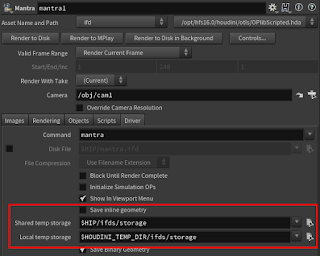

## New Network Editor

さて、賛否両論ありそうなこれ。見た目は可愛くなりましたね。
そして描画速度も速くなりました。Pythonでノードを何千と作ったり、AlembicのHierarchyを保持して展開するときなど、大きな差が出そうです。


あのノードの形、可愛くないから使いたくないとか、デフォルトを変えたいって人はいるでしょう。僕はノードを組む上での自分なりのルールがあるためノードの色が最初から付いているのは非常に不便でデフォルトを変更してます。

そこで、どうやってカスタマイズするかを紹介します。

書き方は、インストール先の$HFS/houdini/OPcustomizeに記述されてるので覗いてみてください。

[Sample](OPcustomize)


文頭がopdefaultcolorで始まるのが色の設定。 文頭がopdefaultshapeで始まるのが形の設定。
では、$HOME/houdini16.0/OPcustomizeというテキストを作って編集してみましょう。

まず形から変更してみましょう。
SopのMergeを丸にするには

```
opdefaultshape Sop merge circle
```

形の種類ってヘルプのどこかに書いてあるんですかね？5分位探してなかったのであきらめました。
そこでPythonで選択したのノードの形を取得してみます。

``` python
import hou

n  = hou.selectedNodes()[0]

ns = n.userData('nodeshape')

ds = n.type().defaultShape() 

print(ns, ds)
```

userDataに入ってるのは、NetworkViewで変えた形で、defaultShapeは名の通りです。

続いて色です。個人的に勝手にノードに色がつくのはうっとおしかったため、すべての色の設定をクリアしました。

```
opdefaultcolor -c
```

これで、Houdini Pathの順番で、このファイルより前で設定されたopdefaultcolorはClearされます。
形の設定をクリアするには、同じく-cです

```
opdefaultshape -c
```

色をつけるには

```
opdefaultcolor Sop  rop_geometry 'RGB 0.451 0.369 0.796'
```

ノードの名称、色とか形を調べるのはメンドイんで、ノードを選択して実行すれば分かるようにして、作業しました。

``` python
import hou

ns  = hou.selectedNodes()

for n in ns:

    nn = n.type().nameWithCategory()
    cd = n.color()
    ds = n.type().defaultShape()
    us = n.userData('nodeshape')
    
    print( "Name:%s, Color:%s, Defalut Shape:%s, User Shape:%s" % (nn, cd, ds, us) )
```

なんで、こんなことをしたかというと、例えば、チーム内で「このノードの色はこういう条件の時のみ使用しよう。」とか「このノードの形は書き出しを意味する。」とか決めておけば、他の人の複雑なシーンファイルを渡されても、どのノードが重要なのかとか何をしてるのか、わかりやすくなっておすすめです。

## Mantra

ifdを書きだすとき、Geometryを別のファイルとして保存することによって、時間短縮されるようになりました。以下のパラメータが追加されています。



ifdにすべて書き込みたい場合はSave inline geometryにチェックを入れてください。
パイプラインのある会社では、レンダー終わったあとにifdを消す仕様にしてるところもあると思いますが、ここのtemp storageを消すように考慮したほうがいいかもしれません。

___

毎回のごとく素晴らしいアップデートばかりです。でも時々、なんで変更したのかとか、なぜこうしないんだとか思うことがあるかもしれません。しかし、ちゃんと訳を聞いてみると、納得出来ますし、従ったほうが吉です。フォーラムで見かけた言葉を引用すると です。