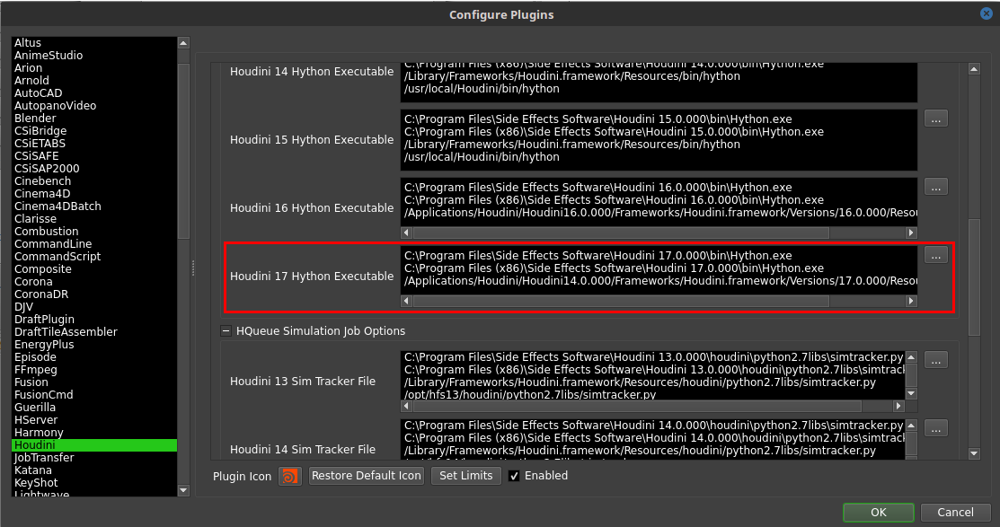
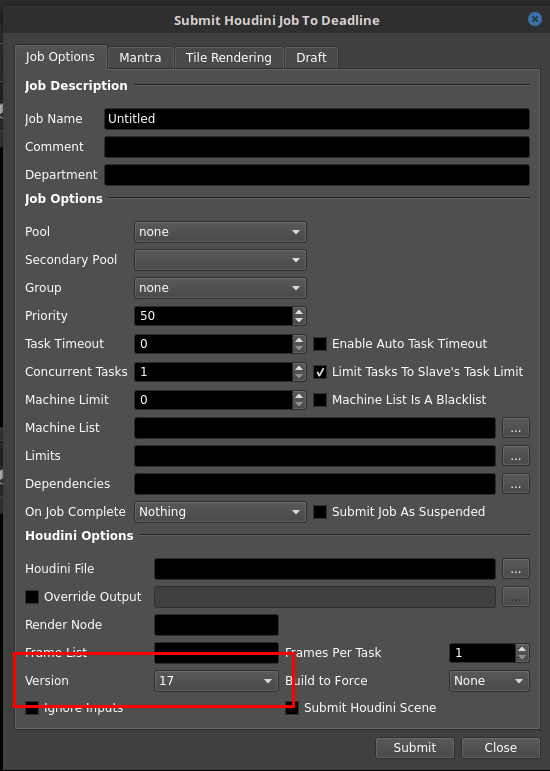

時々、悩んでる人がいたので、Deadlineネタを１つ。

どんなソフトでも、マイナーアップデートは簡単にできますが、メジャーアップデートは、プロジェクトの兼ね合いや自社Plugin/Toolの影響で、そうは容易くできません。アップグレードの金を出すのに渋って更新してないのでなく、ただ単にめんどくさいという理由で更新されてなかったら、担当者のケツを蹴っ飛ばして更新してもらいましょう。

いろんな理由でDeadlineのバージョンが古すぎて、最新のHoudiniのバージョン使用できないという人もいるでしょう。今回は、そんな人向けへの裏ワザを紹介します。

※この記事は、Deadline Client Version: 9.0.6.1の元、作成しています。


## Configure Plugins

まずは、 Configure Pluginsに任意のバージョンを追加して、Pathをセットできるようにしましょう。

以下のファイルを探しだして、[Houdini16_Hython_Executable]の次に追加します。
`$DEADLINE_REPOSITORY/plugins/Houdini/houdini.param`

``` html
[Houdini17_Hython_Executable]
Label=Houdini 17 Hython Executable
Category=Render Executables
CategoryOrder=0
Type=multilinemultifilename
Index=8
Default=C:\Program Files\Side Effects Software\Houdini 17.0.000\bin\Hython.exe;C:\Program Files (x86)\Side Effects Software\Houdini 17.0.000\bin\Hython.exe;/Applications/Houdini/Houdini17.0.000/Frameworks/Houdini.framework/Versions/17.0.000/Resources/bin/hython
Description=The path to the hython executable. It can be found in the Houdini bin folder.
``` 

そうすると、Configure Pluginsをみてみると追加されています。簡単ですね。各自インストールフォルダを指定してあげてください。 Distribute Sim使う人は、Sim Trackerも追加しときましょう。（HQueue使う人ってどれくらいるんだろう？使わないよね？）



Buildを指定したいなら、Houdini16.5.123_Hython_Executableみたいに作ることも可能です。
Mantraも同じ要領でやればできます。


## Houdini Submission

Submission WindowのVersion指定メニューに、任意のバージョンを足すには、以下のpythonを変更します。 `$DEADLINE_REPOSITORY/scripts/Submission/HoudiniSubmission.py`  以下のラインを探しだして、任意のバージョンを追加してください。

``` py
scriptDialog.AddComboControlToGrid("VersionBox","ComboControl","14",("9","10","11","12","13","14","15","16","17",), 5, 1)
```

これだけです。



## Deadlineは結構いいよ

以上の手順を踏めば、投げられるようになったと思いますが、 Deadlineはバッチ処理をする前に、いくつかのプロセスを処理してるので、あまりにも古いバージョンを使用してる場合は、ノードのパラメータ名が変わっていたり、対応してないかもしれません。
そんな時は、`$DEADLINE_REPOSITORY/plugins/Houdini/hrender_dl.py`をなんとかなります。

ちなみに9の最後のほうでOpenGL Ropに対応したり、10からBuildバージョンを指定できるみたいです。Houdiniユーザも増えてきて、ようやく当たり前にあるべき機能が追加されていきましたが、はっきり言って遅いです。いつも小出しで出してくるので、バージョンアップは欠かせないです。Houdini用のPythonも、おそらくHoudiniに精通した人が書いていないため、かゆいとこには手は届いていないですし、書き足し×２でやってるため、きれいではありません。


個人的には、MarzaのオリジナルDispatcherのほうが、頭いいので断然好きですが、Deadlineはインストールすれば、多くのことがすぐにできるようになります。そして今回紹介したように、こういったファイルをいじれば簡単に編集でき、TDでなくても自分たちの環境に合わせたカスタマイズは容易です。小さい会社やTDがいない会社にはおすすめです。

 いつか、僕が会社でやってるDeadlineカスタマイズを公開できればいいですね。