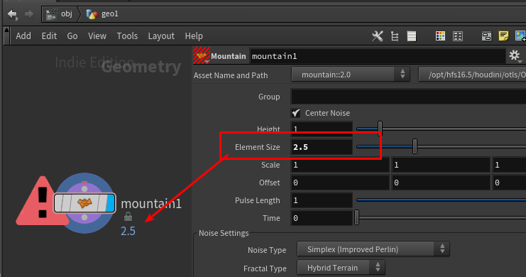

<!--  -->



 


大したことじゃないけど、最近のお気に入りを紹介するコーナ。
第一弾は右クリック。

FXを作ってく上で、僕には2大裏テーマというものがあります。それは  です。今回は後者のために、必要なカスタマイズです。

 ノードのプリセットに入れればいいじゃんと言う人もいるかもしれないですが、あれはパラメータの並び順や位置のレイアウトも記憶しています。Houdiniはバージョンが変わると、パラメータのレイアウトが変わることなんてことは当たり前なので、バージョンごとにプリセットを更新する必要があり非常にめんどいのです。といわけで右クリックのメニューにサポートツールを追加して効率化を図っています。


メニューの追加の仕方ですが、
ノードを右クリックした時にメニューを追加するには、`OPmenu.xml`を編集します。
パラメータを右クリックした時にメニューを追加するには、`PRAMmenu.xml`を編集します。

基本的には、ここに書いてあるんで、読めばわかります。
[http://www.sidefx.com/docs/houdini/basics/config_menus.html](http://www.sidefx.com/docs/houdini/basics/config_menus.htm)

---

お題として、先日パベルさんのセミナーでDescriptive Parmの表示の仕方を習ったので、これをパラメータの右クリックに追加してみましょう。
Descriptive Parmとは、File Sopなどにある、Network View上でノードの名前の下にあるやつです。


 これを、表示されてないノードにも表示させるようにします。これで、いちいちノードを選択してパラメータを見なくても、重要なパラメータの値がNetwork View上で確認できるようになります。しかし、そのパラメータが何かのノードとリンクして、そのノードはクソ重い処理をしなければならないのなら、この値を表示するために、毎回時間がかかってしまうので、気をつけてください。

最初に、Pythonでどうやるか確認しましょう。ヘルプを見るとノードのUserDataを変更すれば、いいようです。
http://www.sidefx.com/docs/houdini/network/badges.html#textbadges

上の添付のようにMountainSopのElement Sizeを、Network Viewに表示させるには、Pythonはこんな感じ。

```python
node = hou.node('/obj/geo1/mountain1')
parm_name = 'elementsize'
node.setUserData("descriptiveparm", parm_name)
```

ノードと、Descriptive Parmになるパラメータの名前が必要ですね。

必要なものがわかったので、実際の作業に入りましょう。まずはPythonファイルを作ります。ここでは、changeDescriptiveParm.pyという名前にして、Houdiniがインポートできる場所に保存します。

```python
import hou

def doit(parms,type):
  parm = parms[0]
  parm_name = parm.name()
  node = parm.node()

  if type == "clear"
    parm_name = ""

  node.setUserData("descriptiveparm", parm_name))
```

現在、右クリックしているパラメータが何かは`parms=kwargs["parms"]`で取得します。`parms`とあるとおり、リストとして値が返ってきます。選択してるパラメータは1つなので、`parm = parms[0]`。パラメータからノードの情報を得るには、単純に`parm.node()`。これで、必要な情報はすべて取得できたことになります。
Descriptive Parmをクリアしたい時もあるので、`parm_name`を空にして、それを可能にしておきます。

最後に、PARMmenu.xmlを編集しましょう。こうです。
``` xml
<?xml version="1.0" encoding="UTF-8"?>

<menuDocument>
    <menu>

    <subMenu id="changeDescriptiveParm">
        <label>Change Descriptive Parm</label>

        <scriptItem>
            <label>Set</label>
            <scriptCode><![CDATA[
import changeDescriptiveParm
reload(changeDescriptiveParm)
changeDescriptiveParm.doit(kwargs["parms"],"set")
                ]]></scriptCode>
        </scriptItem>

        <scriptItem>
            <label>Clear</label>
                <scriptCode><![CDATA[
import changeDescriptiveParm
reload(changeDescriptiveParm)
changeDescriptiveParm.doit(kwargs["parms"],"clear")
                ]]></scriptCode>
        </scriptItem>

    </subMenu>
    </menu>

</menuDocument>
```

Descriptive Parmをセットしたりクリアする必要があるので、サブメニューを作ってどちらかを選択できるようにします。
xmlにPythonを書き込むときは`<scriptCode><

---

僕の作業環境では、最初の動画にあるように、パラメータのスニペットを作っています。
なぜかというと、いちいち`opinputpath('.',0)`とか`centroid(opinputpath('.',0),D_X)`とかタイプするのめんどいですよね。なので、右クリックからできるようにしてます。
xmlをうまいこと編集すれば、右クリックしたパラメータのタイプ等を判別して右クリックにメニューを追加するか否かや、リストに入れるのは必要なスニペットだけにすることもできます。
[ヘルプのMenuItems](http://www.sidefx.com/docs/houdini/basics/config_menus.html#menu-items)にある<scriptMenuStripDynamic>を使います。

例えば、こんな感じです。

```python
menu_items = []
parm = parms[0]
parm_temp = parm.tuple().parmTemplate()
parm_type = parm_temp.type().name()


if parm_type=='String':
   if parm_temp.stringType().name()=='NodeReference' or parm_temp.stringType().name()=='NodeReferenceList':
      menu_items = ["opinput00","opinputpath('.',0)","opinput10","opinputpath('..',0)"]
   elif node=='ifd' and parm_temp.stringType().name()=='FileReference' and parm.name().find('vm_cryptolayeroutput')!=-1:
      menu_items = ['setIfdCrypt','Set CryptoLayer']

elif parm_type=='Float':
   if parm_temp.numComponents()==3:
      menu_items = ["centerOwnVar","center own [ $CEX.. ]",]

return menu_items
```

これで、パラメータがStringで、そのStringのタイプがノードを選択する奴だったらopinputpath系を呼び出したり、パラメータタイプがFloatでサイズが3（float3）だったら、＄CEXなどのポジション等に関するリストを呼び出すこともできます。


みなさんも右クリックによく使う機能を入れて、手の負担を減らしてみてはいかがでしょうか？