This time, the topic is Height Fields.
I don’t think Height Fields are especially useful for FX, but I’d like to introduce some personal FX-style ways of using them.

Here is a sample file. It was created in 17.0.459.

[Download](fxHack_20190211_heightfield.hipnc)

---

## Terrain Object

With the implementation of Height Fields, the Terrain Object DOP got a new option called Use HeightField.

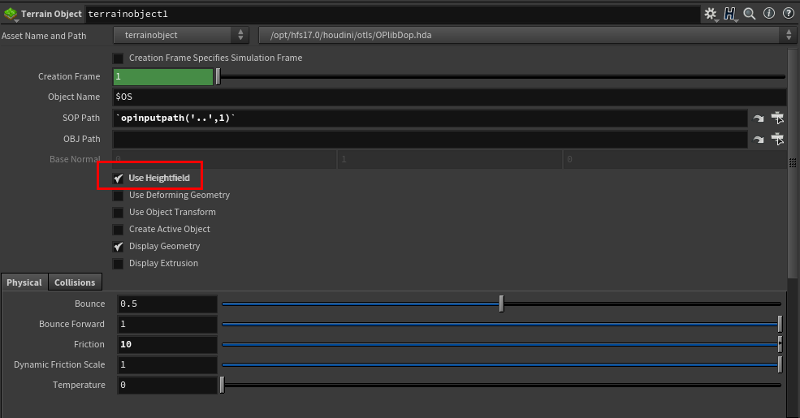

Before this, if you wanted accurate collision between particles and the ground, you had to raise the Division Size in the node’s volume conversion settings, or use Surface Collision with a Static Object. Both of those methods are pretty heavy.

Height Fields, on the other hand, can handle cases where one axis is over 2000 without much trouble. A normal volume would be extremely heavy in that situation. Very SideFX, honestly.

As for the actual workflow, you load terrain made by an Environment Modeler or someone similar, and convert it to a Height Field with HeightField Project.

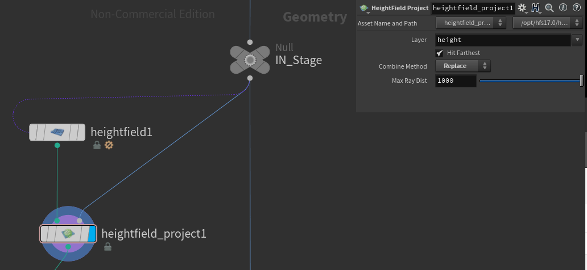

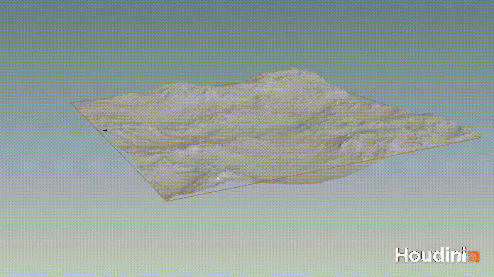

If you want to define the simulation area and work more efficiently, use HeightField Crop.
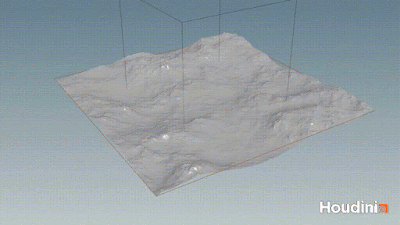

If there are small rocks or debris, projecting them together can still work reasonably well.
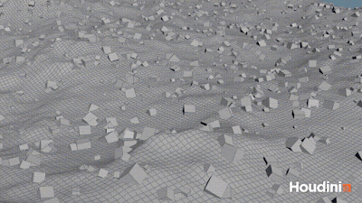

You might ask, what if displacement or bump is being used? 
In that case, bring over the UVs with a point cloud, import the texture, and add it on top.
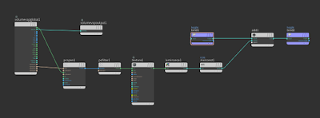
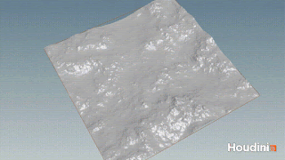

Of course, that does not consider normals. So in that case, you may have to heavily subdivide the imported geometry and apply the displacement in SOPs.

Also, if you use this with packed geometry, it becomes very heavy. So instead of using volume collision, it is better to use normal Bullet collision with Concave.


## Boolean Cutter

Next, here’s another way to use it: try using it for Boolean shatter.
The most important thing when using Boolean is how to create clean geometry without errors so it can be rendered properly. By “errors,” I mean things like non-manifold topology or other issues that can cause problems when importing geometry into other tools through Alembic. If everything stays inside Houdini, you can often still render without worrying too much about those problems.

So why use it for Boolean? Because I really like the characteristics of Height Fields.。

- **Characteristic1:Lightweight**

	As mentioned earlier, it runs very lightly. For fracture cross-sections, you usually want some detail. Normally, you would subdivide the surface and add noise to the points, but that can get pretty heavy. Lightweight is good.

- **Characteristic2:Topology**

	When you convert a HeightField to polygons and look at the topology from the direction where you displaced it, it forms a very clean grid pattern.

	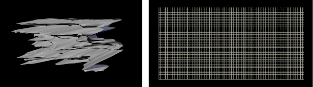

	One of the biggest causes of error topology is when making this noisy cutter. If you apply strong noise to the points of a geometry, the surface can intersect with itself. That is not ideal. And clean topology also makes it easier to create UVs from there.


So here is the actual workflow.
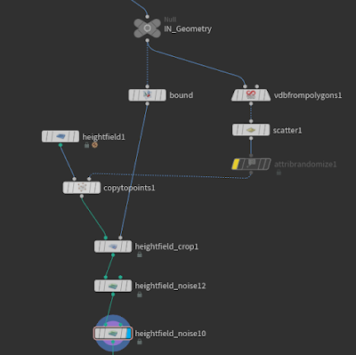

Basically, it is similar to the usual method. Create points, copy the HeightField grid, and add noise to it. Before adding noise, if you crop it with a bounding box slightly larger than the target geometry, it will be more efficient.。
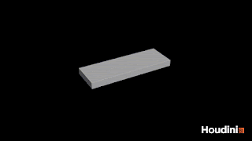


Next, convert the HeightField to a mesh, transfer UVs from the displacement direction with UV Project, and clean them up once with UV Layout. At this stage, the height is not taken into account yet, so adjust the UVs using the point attribute called height.

In a Wrangle, multiply the aspect ratio by height.

``` c
vector bsize = getbbox_size(0);
float mult= bsize[0]/bsize[2];

@uv.y = point(0,"height",@ptnum)*mult;
```

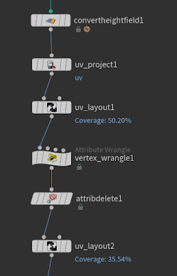

Finally, run UV Layout one more time and that is it.

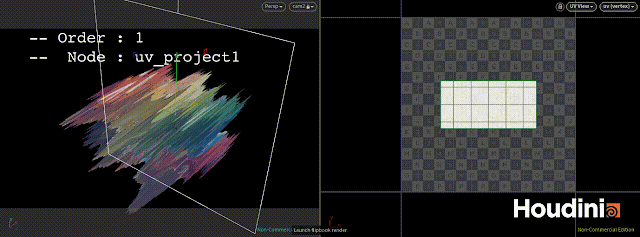

Once the cutter is ready, just shatter it with Boolean as usual.

After that, add normals and use Clean or PolyDoctor to remove non-manifold parts. Errors can still happen sometimes.

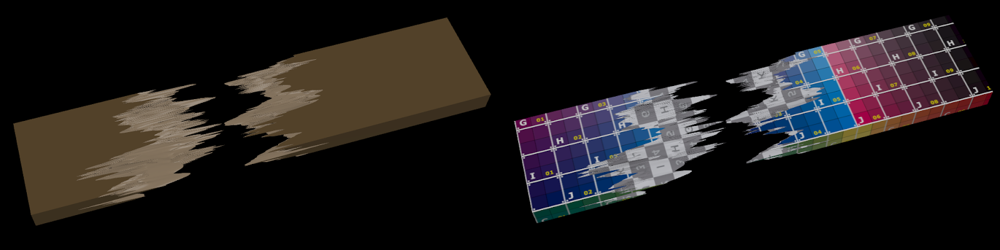

At this point, if the UVs are already there, even if you restore the fractured pieces for the Modeler or LookDev team to create textures or shaders, they probably will not complain. I hope.

Anyway, this was an introduction to a use case that is different from the original purpose.

If anyone else is using it in unusual ways like this, I would love to hear about it.
