今回は、Height Fieldです。
FXは、Height Fieldの恩恵は、あまりないと思いますが、個人的なFX的使い方を紹介します。

サンプルファイルです。17.0.459で作成。

[Download](fxHack_20190211_heightfield.hipnc)

---

## Terrain Object

Height Filedの実装にともないTerrain Object DOPにUse Heightfiledというオプションが追加されました。

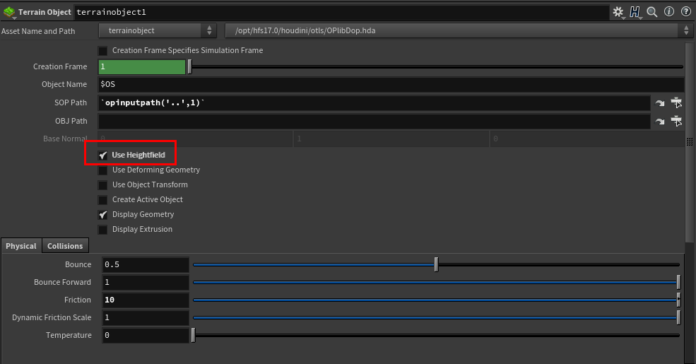

今までは、Particleと地面の詳細なコリジョン結果を得るには、このノードのVolumeに変換する所のオプションにてDivisionSizeをあげて高解像度にするか、StaticObjectをつかってSurface Collisionを使用したりしてました。どちらも、軽いものではありませんね。

Height Filedは、どこかの軸が2000を超えてもなんてことありません。普通のVolumeのならめっちゃ重いですよね。これを使うなんて、さすがSideFX。


 さて実際の使い方は、Environment Modeler等が作ってくれた地形等を読み込み、HeightField ProjectでHeightFiledに変換します。

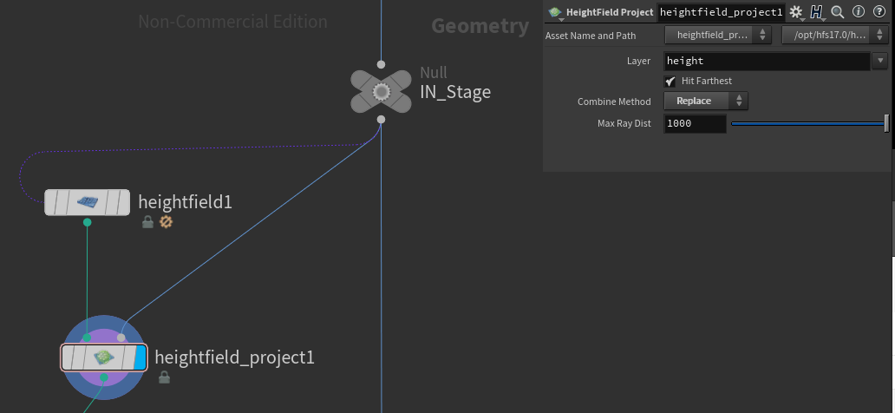

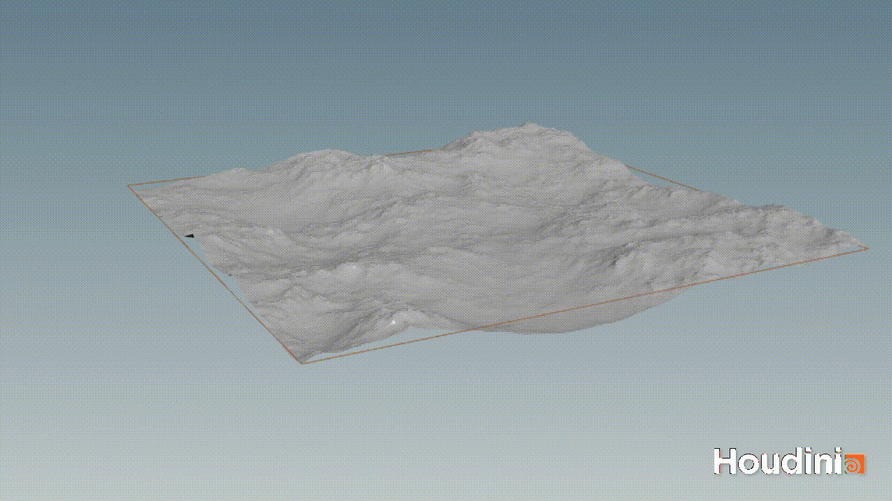

シミュレーションの範囲を決めて、より効率的に作業するならHeightField Cropを使いましょう。
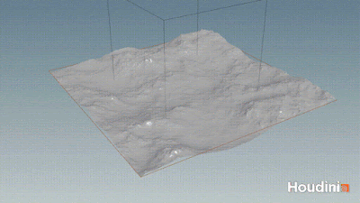

小さな石とかデブリがあったら、それごとProjectionしても、そこそこ使えます。
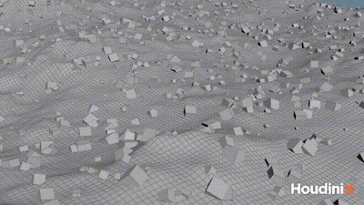

え、Displacement・Bumpを使ってたらどうするんだって？
Point CloudでUVを持ってきて、Textureをインポートして、 足し算。
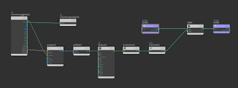
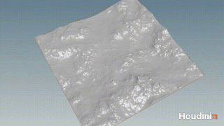

それだとNormal考慮してないってか。インポートしたGeometryをSubdivisionをめっちゃかけて、SopでDisplacementするしかないですかね。

Packでコレ使うと、めっちゃ重いからVolume Collision使わないで、普通にBulletでConcaveにしたほうが良いです。


## Boolean Cutter

続いては、別の使い方の紹介。BooleanのShatterに使ってみましょう。
そもそもBooleanを使う時の重要な点は、如何にエラーのないGeometryを作り出しレンダリングできるようにするかです。「エラー」とはManifold Topologyになっていないものが生成されたり、Alembicを使って他のツールにGeometryとしてインポートするときに起こりうる問題の要因のことを指します。Houdini内で完結する場合は、これらの問題があっても気にせずレンダリングできることが多々です。


なぜBooleanに使うのか？それはHeightFiledの特徴が気に入ったからです。

- **特徴1:軽い**

	前述した通り挙動が軽いです。破壊の断面はディティールが欲しくなります。通常だったら、面を細かく分割してPointにNoiseをかけたりしますが、結構動作重いです。軽いは良いです。

- **特徴2:Topology**

	HeightFieldをPolygonにコンバートして、それをDisplacementした方向からTopoloyを見ると綺麗な格子状になっています。

	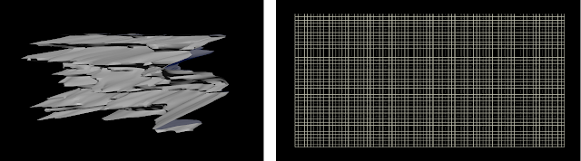

	エラーTopologyを最も生成しやすい要因は、このNoiseのカッターを作ってる時です。GeometryのPointsに対して、強いNoiseをかけると、自身の面と干渉してしまいます。これは、あまり良くないです。
	そして、綺麗なTopologyということは、ここからUVが作りやすいです。 


それでは、実際の手順の説明です。
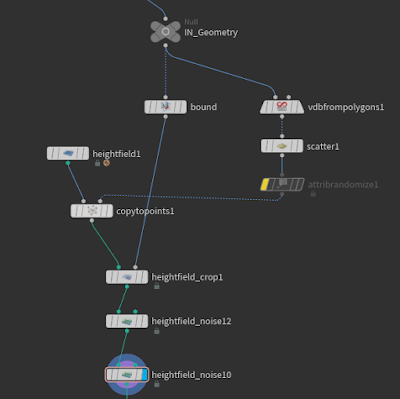

基本的には普通よくあるやつと似てます。Point作ってHeightFiledのGridをコピーしてNoiseをかけます。
Noiseをかける前に対象Geometryより少し大きめなBoundigBoxを使ってCropしてあげれば、より効率が良くなります。
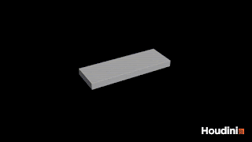


続いて、HeightFiledをMeshにコンバートし、UV ProjectでDisplacement方向からUVを転写。UV Layoutで一度整えます。このままだと高さが考慮されていないので、heightというPointAttrを使ってUVを調整します。

Wrangleで縦横比をheihgtで乗算

``` c
vector bsize = getbbox_size(0);
float mult= bsize[0]/bsize[2];

@uv.y = point(0,"height",@ptnum)*mult;
```

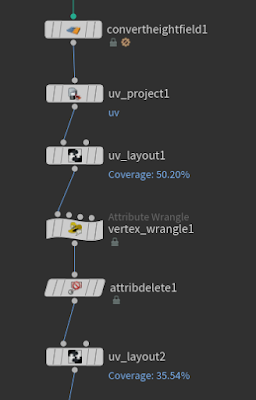

最後に、UV Layoutでもう一度整えておしまいです。

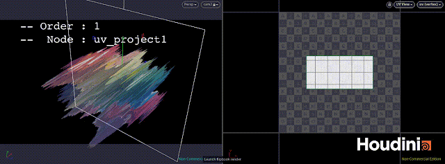

Cutterの用意ができたら、あとは通常通りBooleanでShatterしましょう。

その後は、Normal入れたり、

Non-Manifoldを取り除くために、CleanかPolyDoctorで治しときましょう。エラーは出るときは出ます。

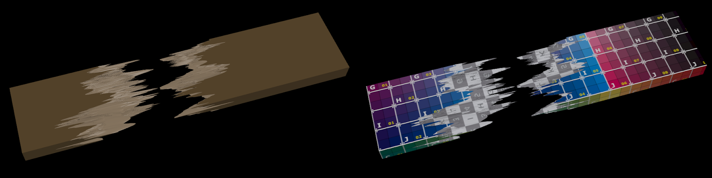

ここまでUVがあれば、ModelerやLookDevにTexture・Shaderを作ってもらうために壊したものを戻しても、文句は言われないでしょう。きっと。

ということで、今回は本来の用途とは違った使い方の紹介でした。

他にも、こんな風に本来の目的とは違う使ってるよって方いましたら、ぜひ教えてください。
