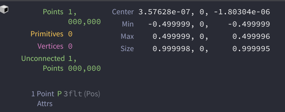

いままで何回もHoudini Workflowをつくってきたので、どんなことをやっているか紹介したいと思います。

小規模な会社にいるからとか個人でやってるから、そんなの必要ないと考える人もいるかもしれませんが、そうは思いません。数人の会社で働いたことがありますが、確実にワークフローが少しでもないと良いパフォーマンスを出すことをできません。

大規模な会社には専任のTDがいてパイプラインがしっかりあり、色々便利なこともあります。反面、大きくなりすぎた会社ほど、やる気のない人や老害がたまり自由度がなくなり最新の流れにもついていけなくなったり、ワークフローを作るのに大工事したり、パイプラインにも手をいれなければいけないみたいなことも起こってしまいます。小規模だとパイプラインを作るのは難しいですが、ワークフローは自分たちの好きに作りやすいです。自分たちにあったものを構築できれば、小回りがきいて大きな所に負けないワークフローを構築しアドバンテージにすることも出来ます。

ワークフローは、TDの人やスクリプトをかける人が作るものだと考えるでしょうが、実際に作業するアーティスト主導で構築するべきです。なぜならそのワークフローを使うのは作業者であり、なにが必要なのかを知ってるのは作業者であるアーティストだからです。


## パイプライン？　ワークフロー？
そもそもパイプラインとワークフローの違いはなんなんでしょうか？

 です。決められた場所かつ安全な場所にパブリッシュしたり、決まったフォーマットに変換したりします。また、ファイルの命名規則やチェック方法やShotgunとの連携もこちらの役割です。

 を用意しておくことです。

パイプラインはTDが担当しますが、ワークフローは出来る限りそのツールや流れを熟知した人が作るのに携わるのが良いと思います。そしてFXはPythonは書けて当たり前なので、TDにお前らどうせ自分たちで出来るからとか言われ、他の部署を先にやってからと後回しにされがちです。


## 目的
まずは何のためにワークフローを作るかの目的をしかっり決めましょう。

私はいつもアーティストが絵作りだけに集中できる環境を作ることを目的にし、できるかぎりのことをするようにしています。

何を基準にツールやルールを作るかというと、基本この２つをベースに考えます。

1. 
2. 

代表格は、キャッシュやレンダーの出力先を毎回入力することです。これはもはや人間のやることではありません。

チームで新しくワークフローを作る場合は、みんなの意見を聞いて不便なことや要望を洗い出してあげることも大事です。

チームにジュニアレベルの人やHoudiniに詳しくない人がいるとしたら、色んなレベルの人にもスムーズにいくルールを考える必要があるかもしれません。


## 環境変数
まずプロジェクト固有の変数について考えましょう。変数は、


プロジェクト名やシーケンス名を定義しとくとフォルダの移動やアウトプット先を決めるのが楽になります。ただこの変数はパイプラインとして設定されてることが多いです。小規模な会社や個人では自身で設定してもいいと思います。これらを設定することによってどういうことが出来るかはあとで説明します。

```
PROJ = 'BurningProj'
```

他のソフトからAlembic等でデータを持ってきた時、シーンスケールを正しくしてあげる必要があります。なぜなら、Houdiniのシミュレーション系ノードのデフォルト値は、1Grid=1mを前提として値が設定されています。これにあわせてやるのが一番良いです。

大抵の場合はインポートしたものを0.1倍か0.01倍すればいいでしょうが、海外のクライアントからもらったデータはメートルでなくインチで作業してる場合があります。その場合は39.37で割る必要があります。覚えたくないですよね。なので、コレも変数にしておきましょう。

```
SCALE_FACTOR = 10
```

他には、レンダーサイズも変数にしてもいいかもしれません。
```
RENDER_RES_X=1920
RENDER_RES_Y=960
```

また、WinodwsやLinuxのプラットフォームが混在してる場合、マウントするところを変数にしたとき、少し便利になります。どいうことかというとWindowsは`Z:/proj/BuringProj`がLinuxでは`/proj/BuringProj`の場合、`$PROJ_ROOT/BuringProj`という書き方に統一できます。協力会社によってはクライアントと同じドライブレターが使えないときは、協力会社に$PROJ_ROOTを`X:/good_client/A_Inc/proj`みたいに設定してもらえれば、フォルダ構造を維持したままシーンファイルを渡せば、別の環境でもシーンを容易に再現できる可能性が高まります。
```
PROJ_ROOT = 'Z:/proj'
```

日本でもNetflixの仕事が増えてきたせいか、やっとColorMangementが浸透してきましたね。Houdiniも他のソフト同様、OCIOの環境変数を設定してあげる必要があります。ACTIVE_VIEWSはなくてもいいです。VFXではシーケンスやショットごとでLutが違う場合があるので、OCIO_ACTIVE_VIEWSを変動出来るようにしてもいいかと思います。
```
OCIO='/proj/BurninigProj/tools/OCIO/will_be_beautiful.ocio'
OCIO_ACTIVE_VIEWS='Rec.709'
```

ローカル変数の代表は、シーケンスとショット番号、フレームレンジとかでしょうか。
```
SEQ = 'seq_01'
SHOT = 'shot_003'
P_START = 1001
P_END = 1032
```
さて、これらをどうやって全員に行き渡せるかですが、大きい会社ならランチャーがあると思うので、そこで設定してもいいです。

小さい会社や個人の場合は、パッケージを使うといいでしょう。 https://www.sidefx.com/ja/docs/houdini/ref/plugins.html


たとえば`/proj/BurningProj/tools/houdini`というフォルダの中にプロジェクトのHDAやスクリプトを置き変数を定義するとします。
```

/proj/BurningProj

└── tools

    └── houdini

        └── otls

        └── packages

        └── scripts

        └── toolbar

    └── maya

    └── nuke
```

まずメインのパッケージを作ります。これをpackagesフォルダのBurningProj.jsonに保存します。

``` json

{   "env" : 
    [
        
        { "PROJ" : "BurninigProj"},

        {"PROJ_ROOT":
             [
                {"houdini_os != 'windows'" : "/proj"},
                {"houdini_os == 'windows'" : "Z:/proj"},
            ]
        },

        {"TEAM_FX":
             [
                {"houdini_os != 'windows'" : "/team/fx"},
                {"houdini_os == 'windows'" : "T:/fx"},
            ]
        },


        { "PROJ_TOOLS_HOU" : "$PROJ_ROOT/$PROJ/tools/houdini" },
        { "TEAM_TOOLS_HOU" : "$TEAM_FX/tools/houdini/houdini$HOUDINI_MAJOR_RELEASE.$HOUDINI_MINOR_RELEASE" },

        
        { "NAGAMOCHI" : "$TEAM_TOOLS_HOU/Nagamochi" },
        { "SIDEFXLABS" : "$TEAM_TOOLS_HOU/SideFXLabs" },


        { "RENDER_RES_X" : 1920 },
        { "RENDER_RES_Y" : 960 },
        { "SCALE_FACTOR" : 10 },
        

        { "OCIO" : "$PROJ_ROOT/$PROJ/tools/OCIO/will_be_beautiful.ocio" },
        { "OCIO_ACTIVE_VIEWS" : "Rec.709"},


        { "HOUDINI_BUFFEREDSAVE":
             [
                {"houdini_os != 'windows'" : 0},
                {"houdini_os == 'windows'" : 1},
            ]
        },


        { "HOUDINI_PATH" :          
            
            [
                "PROJ_TOOLS_HOU",
                "$NAGAMOCHI/common",
                "$NAGAMOCHI/houdini$HOUDINI_MAJOR_RELEASE.$HOUDINI_MINOR_RELEASE",
                "$SIDEFXLABS",
            ]
        },

    ]
}
```

つづいて、BurinungProj_User.json(名前はなんでもいい)というファイルを個人の$HOME/houdini18.5/packagesの中に入れてもらいます。このファイルの中身はこうです。1つ前で作ったJsonの置き場を参照してるだけです。

``` json
{
  "package_path": "/proj/BurningProj/tools/houdini/packages"
}

```

こうすることによって、環境変数等を変更したい時にメインのひとつだけを編集すれば良いようになります。

大きい会社でも、融通が聞かないTDがいたり自由度のないランチャーを使用してる場合でも、このパッケージの仕組みを使えば、いちいちチケットを切らずに変数の管理が出来るようになります。


## HOUDINI_PATH
環境変数を設定する時、特に 

デフォルトは以下の順で読み込みます。

1. $HIP
2. $HOUDINI_USER_PREF_DIR
3. $HFS/houdini
4. $HFS/bin

プライグインによってはHOUDINI_PATHの順番を指定してくるものがあります。例えばArnoldは、デフォルトより前に入れてとあります。たしかSOHOの関係だったかな？

順番の確認はShellで`hconfig -ap`とタイプして確認しましょう。何を言ってるかわからない人は、以下のリンクをどれか見てください。

[hconfig（サルにもわかる)](http://ikatnek.blogspot.com/p/houdini-environment-variables.html)　[hconfig (Indyzone)](https://houdinifx.jp/blog/%E7%92%B0%E5%A2%83%E5%A4%89%E6%95%B0%E3%81%AE%E3%83%91%E3%82%B9%E3%81%AE%E8%A8%98%E8%BF%B0%E3%81%AE%E4%BB%95%E6%96%B9/)   [hconfig (BornDigital)](https://support.borndigital.co.jp/hc/ja/articles/900001589506-Houdini%E3%81%A7%E8%A8%AD%E5%AE%9A%E3%81%95%E3%82%8C%E3%81%A6%E3%81%84%E3%82%8B%E7%92%B0%E5%A2%83%E5%A4%89%E6%95%B0%E3%82%92%E5%8F%96%E5%BE%97%E3%81%99%E3%82%8B)


## キャッシュの保存先

FXにとっての悩ましい大きな種の1つは、ストレージを簡単に圧迫させてしまうことです。ここの管理をいかに簡単にし、サイズを出来る限り小さくすることは非常に重要なことです。以下のことを目的として保存先とフォルダ構成を考えいています。

1. 
2. 
3. 
4. 


まず最初にどこにファイルを保存するかを決めましょう。ここで2つの例をだして考えてみます。

こういうフォルダ構造があったとします。ユーザの作業フォルダにキャッシュフォルダを作成する場合です。

`/proj/$PROJ/work/$SEQ/$SHOT/$DEPT/$USER`
```
/proj/BurningProj

└── work

    └── seq_01

        └── shot_003

                └── fx

                    └── shohei

                        └── caches

                        └── comp

                        └── flipbook

                        └── houdini

                        └── nuke

                        └── render
```

こういう構造なら、Houdini内部では`$HIP/../caches`と書くだけでいいです。`'..'`は一つ上の階層にいくという意味です。なんかプロシージャルっぽいですね。

ただDispatcherを使用している場合は、シーンファイルを別の場所に複製して、そのファイルを使用してサーバで回す場合があります。その際は、サーバでシーンファイルを開いた後に$HIPを上書きしてやる必要があります。


次の例は作業フォルダではなくキャッシュ専用のフォルダを作る方法です。こんな感じです。

`/proj/$PROJ/caches/$DEPT/$USER/$SEQ/$SHOT/`
```
/proj/BurningProj

└── caches

    └── fx

        └── shohei

             └── seq_01

               └── shot_003

        └── bob

             └── seq_05

               └── shot_012
```


これだと、まず各ユーザーがどれだけ使ってるのかを把握するのが簡単になります。ただ、作業フォルダとは別の所にあるので、ファイルブラウザでの移動は面倒になります。また、プロジェクトが終わった時に、`/proj/$PROJ/caches`のフォルダを消すだけで一発ですべてのキャッシュが消えるメリットもあります。

ただどちらも、作業者が変わると$USERが変わってしまって他人のキャッシュが読み込めなくなる問題はあります。

どのフォルダ構造が最適解かというのはないと思います。ここはパイプラインやシステムチームのルールにのっとりつつ、管理のしやすさを考慮しながら考えるのがいいでしょう。

保存先が決まった場合、ここでは`$HIP/../caches`にしたとします。ここより下はどうしたら良いか考えます。Houdiniのデフォルトから考察してみましょう。ファイルキャッシュ系のノードの書き出し先のデフォルトはこうなっています。

```
$HIP/geo/$HIPNAME.$OS.$F.bgeo.sc
```

まず保存先`$HIP/../caches`に変更します。

```
$HIP/../caches/$HIPNAME.$OS.$F.bgeo.sc
```

$HIPNAMEがはいってるとシーファイル名が変わったらキャッシュの読み込みができなくなるので消します。

```
$HIP/../caches/$OS.$F.bgeo.sc
```
書き出しノードが複数あったらcachesというフォルダ下にすべてが保存され管理しにくくなります。なのでノードごとでフォルダを分割します。
```
$HIP/../caches/$OS/$OS.$F.bgeo.sc
```
これでも問題があります。たとえばOBJに2つのノードがあって、中に同じ名前のキャッシュノードがあったら、書き出し先が同じ問題が発生してしまいます。( `/obj/explosion/cache` と `/obj/water/cache`は一緒になる）

回避方法の1つの案としては、親のノード名は異なっているので、フォルダ名に親の名前をいれてバッティングを避けます。（ `/obj/explosion/cache`は親の名前がexplosion、キャッシュ名はexplosion__cacheになる）
```
$HIP/../caches/`opname("..")`__$OS/`opname("..")`__$OS.$F.bgeo.sc
```
最後にバージョンでフォルダを分けたいのでバージョンもいれます
```
$HIP/../caches/`opname("..")`__$OS/`chs('version')`/`opname("..")`__$OS.`chs('version')`.$F.bgeo.sc
```
こういう結果になりました。

```
└── caches

    └── explosion__cache

        └── v001

            └── explosion__cache.v001.1001.begeo.sc

        └── v002

    └── water__cache

        └── v001

```


Pixarの例を見てみましょう。このビデオから彼らのキャッシュノードを見ることが出来ます。

https://vimeo.com/269027205#t=170s

彼らのパスはこうなっています。
```
$FXINSTDIR/caches`opfullpath(".")`/$FF.bgeo.sc
```
$FXINSTDIRはどうなっているかはわかりませんが。caches以下がcaches`opfullpath(".")`となっています。`opfullpath(".")`はそのノードのフルパスを返してくれます。`/obj/geo1/rop_geometry1`みたいな値が返ってきて、フォルダもこんな感じで作られます。
```

└── caches

    └── obj

        └── geo1

            └── cache

                └── 1001.begeo.sc

                    1002.begeo.sc

        └── dopnet1

            └── objnet1

                └── geo1

                    └── cache

                            └── 1001.begeo.sc

                                1002.begeo.sc

```

私があげた例だとDopの中にObjnetつくって、同じ名前のノードたちを作ってしまったらキャッシュを上書きしてしまう可能性があります。Pixarの場合だと作られるフォルダの深さが一緒ではないので、スクリプト等で管理するのが面倒くさくなるかもしれません。

基本的にここまで書いてある内容は中間ファイルを想定しています。中間ファイルとは、レンダーや他のソフトに持ってく用のデータではありません。

正解は無いと思うので、自分たちにあったものを見つけてください。


## キャッシュのオプティマイズ

まーもうHoudiniもだいぶユーザー増えてきたし、知ってて当然のことなんで割愛してもいいかと思いましたが、一応さらっと触れときます。


まず、必要ないアトリビュートは消しましょう。例えば100万ポイントを保存したとします。

アトリビュートがPしかない場合、10.7MBのキャッシュが出来ました。そこに色を足すと21.6MBです。**PもCdもVector3なので、ほぼ2倍のサイズになります**。なので必要ないアトリビュートは消しましょう。

またAttributeCastというノードを使って、値を32bitから16bitにすればキャッシュサイズが小さくなります。ただこれは、浮動小数点演算の精度を下げていることを留意しないといけません。そして32から16にしたあとに32へ戻しても元の値に戻ることはありません。

|                                     | Attrs                           | Size   |
| ---------                           | --------                        | ------ |
|| P(Vector3)                      |10.7MB|
|| P(Vector3) rand_val(Float)      |14.4MB|
||P(Vector3) Cd(Vector3)           |21.4MB |
||P(Vector3) Cd(Vector3, 16bit)    |16.1MB|

他の案として、これは少し手間ですが、フレームによって変動しない値があるのなら、その値だけ別ファイルに1フレーム保存し、他の動いてる値にあとからAttibuteCopyするのもありです。


続いてVolumeのオプティマイズです。

Pyro Post-Pprocess Sopというのができて、使ってる人もいるでしょう。ただなぜあれは、VisualizeとOptimizeを一緒のノードにしたのか。分けて欲しかった。

では色々比較してみましょう。

|                                     | Type                           | Size   |
| ---------                           | --------                        | ------ |
|| 1. 何もしてない                    |66.2MB|
|| 2. Native VolumeをCompress      |29.6MB|
|| 3. 1つ上のに対し、Quantization Tolを0.001           |27.4MB |
|| 4. VDBで16bit    |33.8MB|
|| 5. VDBの16bit。Densityが無いエリアのVel削除    |11.1MB
|

他にもVelフィールドだけ、Voxelの解像度を落としてやるとかもありますね。

上の表を見てもらうとわかると思いますが、5番だけ説明をします。
Volumeに対してMotionBlurをかけるとき、DensityやらTemperatureやらがあるとこのみが、絵に影響します。今回の例で言うとDensityしかありません。Densityのないところは、レンダーに関して言えばVelocityがあっても意味ありません。なので、そこのエリアは消してもいいでしょう。VDBCombineを使ってOperationをActive Intersectionにすると、DensityのVoxelがあるところのみ残ります。これだと際が心配なので、VDB ActiveでDensityのVoxelを広げとくと安心です。


これは、どのレンダラーにも有効です。なぜならファイルサイズが軽くなるほどファイルの読み込みが速くなるからです。とくに貧弱なWindowsやファイルサーバーを使ってる際は、テストし検討してみてください。


ここでは、全てには言及しませんが、これらを取り入れるときは必ず検証してください。  。


## ファイルキャッシュノード
書き出し先が決まったら、ファイルキャッシュ用のノードを作ります。

デフォルトのFileCacheSopではだめです。出力先を設定しなければなりません。もちろんノードを作った時点で、任意のパラメータを自動で変更する仕組みを作ることは可能です。
Houdiniは値を編集したパラメータは太字になるという素晴らしい機能があります。この方法だと作業者は変更していないのに太字になってしまいます。他の作業者の手に渡った時、その値が本当にいじられたがわからなくなるので、避けたほうがよいです。
他にもバージョニングしたかったり、ファイルサイズ削減の機能を入れてもいいでしょう。
 です。なぜならこのノードは必ず誰もが使うことになるノードだからです。


このBlog用にファイルキャッシュを作ってみました。


ファイルパスに直接、環境変数やエクスプレッションを入れるのでなく、一度パラメータに逃すのがオススメです。例えば、他の人からシーファイルを受け継いだ時、このノードのキャッシュは読み込めなくなります。なぜなら$USERがフォルダパスに入ってるからです。USERというパラメータを$USERから前の人のユーザーネームを入れれば読むことが出来ます。そしてファイルパスを直接いじると、どの部分をいじったのかが分からなくなるの避けられるようになります。

独自のファイルキャッシュノードの中にアトリビュートを消したり、VolumeをCompressする機能をつけてもいいでしょう。

また、これみたいに何を変更したのかのノートを書き込めるようにしてもいいでしょう。

https://forums.odforce.net/topic/41473-filecache-hda-with-easy-versioning-naming-and-reviewing/


個人で使ってるのは以下に公開してます。もう少しちゃんと作ってあります。

https://github.com/ShoheiOkazaki/Nagamochi/blob/master/common/otls/SOP__nmFileCache.hda

レンダリングや他のDCCソフトにデータを返すためにAlembicやVDBを作るノードは別途作りましょう。なぜなら中間ファイルとは使用が異なるからです。必要な機能としては、シーンスケールをもどしたり、Alembicをレンダーする際に必要なアトリビュートを整えたりPathアトリビュートを設定したり、VolumeならCompressとかスケールをしたときの影響を直すとかでしょうか。


## HDA作成ルール
HDAを作成するにあったとルールを決めておきましょう。こちらも主に管理目的です。

一番のオススメはバージョニングしましょう。


詳しいことは、ここに書いてあるので読んでください。https://www.sidefx.com/ja/docs/houdini/assets/namespaces.html

なぜ、バージョンを付けたほうが良いかという理由は、。


他のオススメは、ヘルプに更新履歴を書くことです。


もちろん、パラメータの説明をヘルプにすべて書くのがベストですが、かなりの労力を使うので、。

ヘルプについてですが、スクリプトで自動でベースをつくるのがオススメです。自分で書くのは面倒な方は、こういったツールを公開してくれてる人がいますので、使ってみてはいかがでしょうか？
https://vimeo.com/197432788

一応、私が[公開してるツール群](https://github.com/ShoheiOkazaki/Nagamochi)にもあります。


## シーン作業ルール

チームで作業するなら、ある程度のルールを決めたほうがいいです。他の人にシーンを引き継いでもらうときに、わかりやすくしてあげる必要があります。

経験ある方も多いと思いますが、自分が作った2ヶ月前のシーンファイルをみて、何やってんだこれは？という状態になったことはありませんか。ノードの名前ちゃんとしておけばよかったとか思うでしょう。自分以外の人が見たらきっとなおさらわからないでしょう。

ガチガチにルールを決めると返って作業しづらくなるので、最低限のルールを決めて他の人がみても理解しやすくなるように心がけましょう。

ここでは私自身が取り入れている、いくつかの例をお見せします。

1. ノードの色
2. ノードの配置
3. 再現性ある組み方

まずはノードの色。例えばこんなシーンを渡されて「あとはよろしく」と言われてもどこをいじればいいか戸惑うでしょう。


。例えばこんなルールです。

- 黄色 : 絵作り等に必要な重要な調整をしてる
- 緑色 : キーフレームかアニメーションを追加してる
- 赤色 : プロシージャルではない
- 紫色 : 他のノードへ出力されている
- 青色 : Viewportでアトリビュートの値を確認

色がついていないノードは無視していいくらいです。上の添付だと1割も重要なノードは無いことがわかると思います。


ノードの配置にルールをもたせれば、どこに何があるかを把握しやすくなるかもしれません。OBJレベルには、カメラ・ライト・Alembicインポート・作業ノード・レンダー専用のノードといった様々な役割をもったノードが混在してしまいます。個人個人で色んな配置をされるとシーファイルを紐解くのに無駄な時間がかかります。


枠組みを最初から用意してやって、そこにあったノードを配置するのもありでしょう。


最後の再現性のある組み方をするですが、どういうことかと言うキャラクタのアニメーションが更新されたり、中間キャッシュが全てなくなっても、一番最後のノードをレンダーすれば、全てを再現できる組み方をすることです。

これをやるには`/out`にすべてのキャッシュノードとレンダーノードが集まっていて、それらが順番に繋がれている必要があります。ディペンデンシーを組むです。Dispacherを使ってる人はやっていることだと思います。


そして、この組み方をしておけば、アニメーションが更新されたり、別ショットにまるまるシーンをコピーしてもっていったとしても、一番最後のノードのレンダーボタンを押せば、すべてが更新されることが可能です。これぞプロシージャル、これぞHoudiniという使い方です。

これを心がけるのは面倒かもですが、Houdiniの基本、プロシージャルに組むということの鍛錬にもってこいです。


## OnCreated.py
キャッシュは独自のファイルキャッシュをつくって出力先を気することはなくなりましたが、レンダー系はどうしたらいいでしょうか。これは。

https://www.sidefx.com/ja/docs/houdini/hom/locations.html#node_event_files

`HOUDINIPATH/scripts/OnCreated.py`はすべてのノードが作られた時に実行されます。
ただ、これには問題があります。HOUDINI_PATHでいくつかのパッケージを読み込んでいて。複数のパッケージでこれを使いたい場合、運用方法を考える必要があります。

OnCreateはすべてのノードに対して実行されますが、指定したノードのみを実行するには、`HOUDINIPATH/scripts/category/nodename_event.py`にファイルをつくります。例えば、Mantraなら`HOUDINIPATH/scripts/out/ifd_OnCreated.py`にファイルを作ります。

こんなスクリプトを書くと書き出し先の設定とバージョンのパラメータを追加できます。

``` py
n = kwargs['node']

n.parm('vm_picture').set("$HIP/../render/${OS}/${OS}_`chs('version')`.$F4.exr")

parmnum = 8 
addVerParm = eval('hou.%sParmTemplate("%s", "%s", 1,default_value=(["%s"]))' % ('String', 'version', 'Version ', 'v001'))
parm = n.parms()[parmnum]
parmTmp = parm.parmTemplate()
parmGroup = n.parmTemplateGroup()
parmIndex = parmGroup.findIndices(parmTmp.name())[0]
parmGroup.insertAfter(parmGroup.parmTemplates()[parmIndex],addVerParm)
n.setParmTemplateGroup(parmGroup)
```


## 456.py
色々ルールを作っても、すべてを遵守してもらうのは大変です。なのでルールや変数が正しいかをチェックする機能を作りましょう。　

例えば、現在開いてるシーンの$SEQ, $SHOTの値は正しいか、フレームレンジは正しいかです。タイムレンジはShotgunからひっぱて比較してもいいでしょう。

また、カメラが変更されたら作業者は、自分がインポートして使ってるカメラのパスを見て最新かどうかチェックしないといけません。まともな前工程だったらカメラの変更を教えてくれるかもしれませんが、無言で更新することさえあります。めんどくさいですね。なぜ前工程のせいで後工程が・・・以下略

FXの仕事をしていて、モデルやアニメーションが完全にファイナルの状態、ライティングもFXのために用意されてる状態で作業できることなんてあるでしょうか？夢のような状態ですね。
作業中にカメラが変わったり尺が変更されても対応できるようにしておきましょう。今使ってるカメラ・アセット・タイムレンジが最新なのかを、シーンファイルを開いた時にチェックできるようしてもいいでしょう。

といいます。 https://www.sidefx.com/ja/docs/houdini/hom/locations.html#startup

ここに置きます。`HOUDINIPATH/scripts/456.py`

Dispacherを使ってサーバで回すときは、これが動かないような仕組みを入れておいたほうが安全でしょう。

正直ここはパイプラインがしっかりしていないと使う機会がないかもしれません。とりあえずシーンファイルを開いたときに、シーンの中身をPythonでチェックするすべはあるとだけは覚えておきましょう。

## beforescenesave.py
456.pyと同様、シーンを保存する時に何かしらのチェック機能が走ってもいいでしょう。

シーンファイルを開く時は456.py、シーンファイルを保存する直前に動くPythonは789.pyですと言いたいとこですが、そんなものはありません。シーファイルを保存する前に何かをしたい場合は、`HOUDINIPATH/scripts/beforescenesave.py`ここにファイルを作ります。

例えば、$SEQ、$SHOTをセットしたいけど、ファイルマネージャー無い場合どうしたらいいでしょうか。こういうフォルダ構造で作業している場合なら、シーンファイルの場所から$SEQ・$SHOTを割り出せます。

`/proj/$PROJ/work/$SEQ/$SHOT/$DEPT/$USER`

```
/proj/BurningProj

└── work

    └── seq_01

        └── shot_003

            └── fx

                └── shohei

                    └── houdini
```  


Pythonで書くとこんな感じでしょうか。AliasVariablesの値があるかを確認するために`hou.hscript("setenv -s SHOT")`を使ってます。これを使わないとグローバルの環境変数に同じ変数があった場合、そちらの値を参照してしまうので、この方法を取りました。

```py
import hou

hipfolder = hou.getenv('HIP')

dirs = hipfolder.split('/')
new_PROJ = dirs[-6]
new_SEQ  = dirs[-4]
new_SHOT = dirs[-3]

get_PROJ = hou.hscript("setenv -s PROJ")
if 'undefined' in get_PROJ[0]:
    get_PROJ = None
else:
    get_PROJ = get_PROJ[0].split('\t= ')[1].split('\n')[0]
```


## 作っておいたほうがいいノード
#### カメラ

前述したように、他DCCからデータを持ってきた時に、シーンスケールを直さないといけません。カメラも同様です。インポートしたカメラノードの上にNullを作ってNullのスケールを0.1とかにしてますか？ま、Houdiniに詳しい人がいる会社なら、そんなことしてませんよね。Volumeの見た目が薄くなってしまいます。解決策は調べればでてくるので説明はしません。Chopでやったほうがいいでしょう。


私が公開してるツール群のなかにカメラもあるので興味あれば見てください。

https://github.com/ShoheiOkazaki/Nagamochi/blob/master/common/otls/OBJ__nmWorkCam.hd


## おまけ：PDG
キャッシュの保存先でストレージの管理をしやすくと言いましたが、お高いファイルサーバーとかだとディスク使用量を解析できるツールがあったりして、誰がどれくらい使ってるかは結構容易にみることができます。ないとこはどうしましょう。

安心してください。私達には最近PDGという強力なツールを手に入れたので、ディスク使用量も把握が楽になりました


CSVファイルで保存されるので、これをGoogleSpreadSheat等にコピーし、メンバーに共有しましょう。各ユーザーのキャッシュやシーンファイル・レンダーに使ってる容量の一覧を出すのが簡単になります。便利な時代だ。


|folderCacheType|directory|directorySize|
|:----|:----|:----|
|cache|/proj/BurningProj/work/seq_010/shot_009/fx/shohei/cache|84.7|
|houdini|/proj/BurningProj/work/seq_010/shot_009/fx/shohei/houdini|0.1|
|render|/proj/BurningProj/work/seq_010/shot_009/fx/shohei/render|17.2|
|cache|/proj/BurningProj/work/seq_010/shot_011/fx/shohei/cache|18.9|
|houdini|/proj/BurningProj/work/seq_010/shot_011/fx/shohei/houdini|0.2|
|render|/proj/BurningProj/work/seq_010/shot_011/fx/shohei/render|19|
|cache|/proj/BurningProj/work/seq_010/shot_015/fx/shohei/cache|47.7|
|houdini|/proj/BurningProj/work/seq_010/shot_015/fx/shohei/houdini|0.1|
|render|/proj/BurningProj/work/seq_010/shot_015/fx/shohei/render|14.2|
|cache|/proj/BurningProj/work/seq_010/shot_017/fx/shohei/cache|6|
|houdini|/proj/BurningProj/work/seq_010/shot_017/fx/shohei/houdini|0.1|
|render|/proj/BurningProj/work/seq_010/shot_017/fx/shohei/render|10.9|
|cache|/proj/BurningProj/work/seq_040/shot_003/fx/shohei/cache|895.3|
|houdini|/proj/BurningProj/work/seq_040/shot_003/fx/shohei/houdini|18.3|
|render|/proj/BurningProj/work/seq_040/shot_003/fx/shohei/render|347.3|
|cache|/proj/BurningProj/work/seq_070/shot_001/fx/shohei/cache|283.9|
|houdini|/proj/BurningProj/work/seq_070/shot_001/fx/shohei/houdini|0.8|
|render|/proj/BurningProj/work/seq_070/shot_001/fx/shohei/render|124.4|
|cache|/proj/BurningProj/work/seq_070/shot_004/fx/shohei/cache|29.5|
|houdini|/proj/BurningProj/work/seq_070/shot_004/fx/shohei/houdini|0.6|
|render|/proj/BurningProj/work/seq_070/shot_004/fx/shohei/render|0|


## おまけ：Launcherもどき

最初の方で環境変数を設定するところで、ショットの情報を定義してはどうかと書きました。$PROJ, $SEQ, $SHOTのことです。シーンファイルをオープンセーブする自社ツールがあるなら、これらをセットするのは簡単です。そういうツールがない場合は、Shellからソフトを起動するやり方を紹介します。

まず作業するPROJ SEQ SHOTを指定してから、ソフトを起動するようにします。

Linuxでは.bashsrcにaliasを登録します。ここではprojsetとします。

``` sh
function projset() {
    export 'PROJ='$1;
    export 'SEQ='$2;
    export 'SHOT='$3;
    export 'HOUDINI_HIP_DEFAULT_NAME='$1'_'$2'_'$3'_FX_ELEMENT_v001.hip';
    cd '/proj/'$1'/work/'$2'/'$3'/fx/'$USER/houdini;
}

alias projset=projset
```

Shellでprojset [PROJ] [SEQ] [SHOT]をタイプすると、そのShotのフォルダに移動します。


これでHoudiniを起動すると、＄HIPが任意の場所になり、ファイルのデフォルトの名前もセットされるので、セーブ・オープンともに楽になります。
houdiniは起動したフォルダがHIPになります。HOUDINI_HIP_DEFAULT_NAMEを設定すると、ファイルの名前を変えられます。デフォルトはuntitled.hipですね。


Windowsの場合はprojset.batというファイルを、aliasを読み込むことが出来るフォルダに保存。
```shell
@echo off
set PROJ=%1
set SEQ=%2
set SHOT=%3

set HOUDINI_HIP_DEFAULT_NAME=%1_%2_%3_FX_ELEMENT_v001.hip

cd /D W:
cd Z:\proj\%1\work\%2\%3\fx\%USERNAME%\houdini

echo PROJ=%1 SEQ=%2 SHOT=%3
echo HOUDINI_HIP_DEFAULT_NAME=%1_%2_%3_FX_ELEMENT_v001.hip
```


## サンプル

長ったらしい文だけど分かりづらいと思うので、サンプルファイルを作りました。サンプルシーンも入ってます。

[Download](SampleWorkFlow.zip)

使い方は、まず解凍したら、フォルダをどこかに置いてください。

以下2つのjsonファイルの中身のREPLACEという文字を解凍した場所に置き換えてください。

`SampleWorkFlow/packages/BurningProj.json`
`SampleWorkFlow/BurinungProj_User.json`

そして`SampleWorkFlow/BurinungProj_User.json`を、`$HOME/houdini18.5/packages/`にコピーしてください。


## おわりに

ここまで、紹介したことすべてが必要不可欠で最適解だとは考えていません。10年以上Houdiniメインで仕事をしてきて、私がフルスロットで仕事する上に最低限必要ないくつかを紹介させていただきました。

Houdini Workflow作るにはPythonは必須です。OdForceやSideFXのフォーラムにたくさんのサンプルがあります。Gitにもあがってるので調べれば大半はでてきます。最初はPythonを書かない簡単なものから始めてもいいでしょう。キャッシュファイルを作るとかでもいいと思います。

コロナで他の会社の人と交流する機会も減り、情報交換もしづらい世の中になっています。私がいると、こんな感じでやってますが、みなさんはどんなことをしていますか？こんなのが面倒くさいから、こういうのが欲しいみたいな意見でもいいので、ぜひ皆さんからの意見をお待ちしてます。