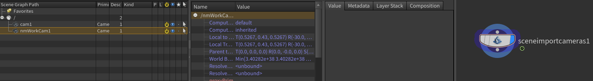

## Issue
When importing your custom HDA camera into Solaris using SceneImportLOP, you can't import it and it appear the waring.

（Custom HDA camera is [some thing like this](../2021-04-29/#%E4%BD%9C%E3%81%A3%E3%81%A6%E3%81%8A%E3%81%84%E3%81%9F%E3%81%BB%E3%81%86%E3%81%8C%E3%81%84%E3%81%84%E3%83%8E%E3%83%BC%E3%83%89).）

The following warning appears. This may probably only appear in 19.5 or later.


## Solution
Let's go to [the link](https://www.sidefx.com/docs/houdini/hom/sceneimport_object_translator.html) that the waring said.


We see the following statement at the beginning of the document. It seems that some work needs to be done to load the custom node into the LOP.
> Expert users can write Python plugins to customize how the Scene Import LOP translates specific Houdini object node types into USD. This is especially useful to translate custom node types, such as light and camera types associated with proprietary renderers. 


If you keep reading after that, you will find a lot of Python and other stuff. But it's a bit long, so I'll ignore it.  
  

Houdini has most of the customizable stuff in the installation folder in a non-binary form, so the quickest way to get started is to copy it over. So let's look at the following files.


`INSTALL_FOLDER/houdini/husdplugins/objtranslators/cam.py`
``` py
import hou
import husd
from pxr import UsdGeom


class CameraTranslator(husd.objtranslator.Translator):

    def shouldTranslateNode(self):
        return True

    def primType(self):
        return 'Camera'

    def populatePrim(self, prim, referenced_node_prim_paths, force_active):
        super(CameraTranslator, self).populatePrim(prim, referenced_node_prim_paths, force_active)
        cam = UsdGeom.Camera(prim)
        proj = self._node.parm('projection').evalAsString()
        if proj == 'perspective':
            cam.CreateProjectionAttr('perspective')
        elif proj == 'ortho':
            cam.CreateProjectionAttr('orthographic')
        # A few of the parameters need to be converted into 1/10 scene unit space
        stage = prim.GetStage()
        factor = husd.utils.convertFromMillimetersToCameraUnits(stage, 1.0)
        self.populateAttr(cam.CreateFocalLengthAttr(), self._node.parm('focal'),
                          lambda value: value * factor)
        self.populateAttr(cam.CreateFocusDistanceAttr(), self._node.parm('focus'))
        self.populateAttr(cam.CreateFStopAttr(), self._node.parm('fstop'))
        self.populateAttr(cam.CreateShutterOpenAttr(), self._node.parm('shutter'),
                          lambda value: value * -0.5)
        self.populateAttr(cam.CreateShutterCloseAttr(), self._node.parm('shutter'),
                          lambda value: value * 0.5)
        self.populateAttr(cam.CreateClippingRangeAttr(), [self._node.parm('near'), self._node.parm('far')])
        # Aperture is a bit more complicated
        aspect = float(self._node.parm('resy').eval()) / self._node.parm('resx').eval()
        win_size = self._node.parmTuple('winsize').eval()
        if proj == 'perspective':
            # Start by grabbing a few values we'll use to scale the attributes
            aperture = self._node.parm('aperture').eval()
            self.populateAttr(cam.CreateHorizontalApertureAttr(), self._node.parm('aperture'),
                              lambda value: value * factor * win_size[0])
            self.populateAttr(cam.CreateVerticalApertureAttr(), self._node.parm('aperture'),
                              lambda value: value * aspect * factor * win_size[1])
            self.populateAttr(cam.CreateHorizontalApertureOffsetAttr(), self._node.parmTuple('win'),
                              lambda value: value[0] * aperture * factor)
            self.populateAttr(cam.CreateVerticalApertureOffsetAttr(), self._node.parmTuple('win'),
                              lambda value: value[1] * aperture * aspect * factor)
        elif proj == 'ortho':
            # Start by grabbing a few values we'll use to scale the attributes
            sceneToMM = 1000 * hou.scaleToMKS("m1")
            orthowidth = self._node.parm('orthowidth').eval()
            self.populateAttr(cam.CreateHorizontalApertureAttr(), self._node.parm('orthowidth'),
                              lambda value: value * sceneToMM * factor * win_size[0])
            self.populateAttr(cam.CreateVerticalApertureAttr(), self._node.parm('orthowidth'),
                              lambda value: value * aspect * sceneToMM * factor * win_size[1])
            self.populateAttr(cam.CreateHorizontalApertureOffsetAttr(), self._node.parmTuple('win'),
                              lambda value: value[0] * orthowidth * sceneToMM * factor)
            self.populateAttr(cam.CreateVerticalApertureOffsetAttr(), self._node.parmTuple('win'),
                              lambda value: value[1] * orthowidth * sceneToMM * aspect * factor)


def registerTranslators(manager):
    manager.registerTranslator('cam', CameraTranslator)

```
Copy this file to an appropriate location. Any file name is acceptable.`$HOUDINIPATH/husdplugins/objtranslators/customCam.py`

It seems to me that you are converting the OBJ camera parameters to USD camera parameters. If you are changing the parameter names of the HDA camera from the default camera, you need to change that part.

If you do not need to do so, simply change the last line.

``` py
def registerTranslators(manager):
    manager.registerTranslator('nmWorkCam::1.1.0', CameraTranslator)
    manager.registerTranslator('nmWorkCam::1.0.3', CameraTranslator)
    manager.registerTranslator('nmWorkCam::1.0.2', CameraTranslator)
    manager.registerTranslator('nmWorkCam::1.0.1', CameraTranslator)
```
It is important to note that you must register a Translator for each version. So register all possible versions.

Reference [SideFX Forum: Custom HDAs Not Supported in LOPS?](https://www.sidefx.com/forum/topic/84598/?page=1)

Now you have successfully imported the data.
