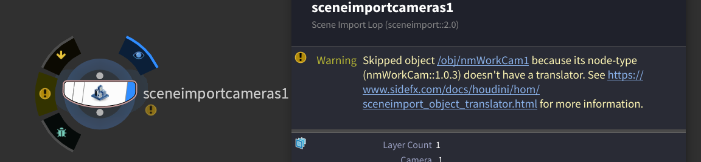
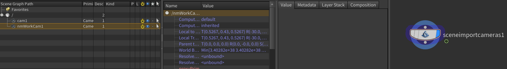

## 問題
SolarisにSceneImportLOPでカメラをインポートする際、自前のHDAカメラをインポートしようとするとワーニングがでてインポートできません。

（自前のカメラとは[こういうHDA](../2021-04-29/#%E4%BD%9C%E3%81%A3%E3%81%A6%E3%81%8A%E3%81%84%E3%81%9F%E3%81%BB%E3%81%86%E3%81%8C%E3%81%84%E3%81%84%E3%83%8E%E3%83%BC%E3%83%89)です）

以下のようなワーニングが表示されます。これはおそらく19.5以降でしか表示されないかもしれません。


## 解決策
まずは言われた通り、[リンク](https://www.sidefx.com/ja/docs/houdini/hom/sceneimport_object_translator.html)に飛びましょう。


以下のような記述が冒頭にありますね。カスタムノードをLOPに読み込むにはなにか作業が必要なようですね。
> Scene Import LOPが特定のHoudiniオブジェクトノードタイプをUSDに変換する方法をカスタマイズすることができます。 これは、特にカスタムノードタイプ(例えば、プロプライエタリなレンダラー関係のライトタイプやカメラタイプ)の変換に役立ちます。


その後を読み続けると色々Pythonやら書いてありますね。でもちょっと長いので無視します。  
  

Houdiniはカスタムできるものについては、インストールフォルダにだいたいのものがバイナリになっていない状態で保存されてるので、それをコピーしてから始めるのが最短の道です。ということで以下のファイルを見てみましょう。


`インストールフォルダ/houdini/husdplugins/objtranslators/cam.py`
``` py
import hou
import husd
from pxr import UsdGeom


class CameraTranslator(husd.objtranslator.Translator):

    def shouldTranslateNode(self):
        return True

    def primType(self):
        return 'Camera'

    def populatePrim(self, prim, referenced_node_prim_paths, force_active):
        super(CameraTranslator, self).populatePrim(prim, referenced_node_prim_paths, force_active)
        cam = UsdGeom.Camera(prim)
        proj = self._node.parm('projection').evalAsString()
        if proj == 'perspective':
            cam.CreateProjectionAttr('perspective')
        elif proj == 'ortho':
            cam.CreateProjectionAttr('orthographic')
        # A few of the parameters need to be converted into 1/10 scene unit space
        stage = prim.GetStage()
        factor = husd.utils.convertFromMillimetersToCameraUnits(stage, 1.0)
        self.populateAttr(cam.CreateFocalLengthAttr(), self._node.parm('focal'),
                          lambda value: value * factor)
        self.populateAttr(cam.CreateFocusDistanceAttr(), self._node.parm('focus'))
        self.populateAttr(cam.CreateFStopAttr(), self._node.parm('fstop'))
        self.populateAttr(cam.CreateShutterOpenAttr(), self._node.parm('shutter'),
                          lambda value: value * -0.5)
        self.populateAttr(cam.CreateShutterCloseAttr(), self._node.parm('shutter'),
                          lambda value: value * 0.5)
        self.populateAttr(cam.CreateClippingRangeAttr(), [self._node.parm('near'), self._node.parm('far')])
        # Aperture is a bit more complicated
        aspect = float(self._node.parm('resy').eval()) / self._node.parm('resx').eval()
        win_size = self._node.parmTuple('winsize').eval()
        if proj == 'perspective':
            # Start by grabbing a few values we'll use to scale the attributes
            aperture = self._node.parm('aperture').eval()
            self.populateAttr(cam.CreateHorizontalApertureAttr(), self._node.parm('aperture'),
                              lambda value: value * factor * win_size[0])
            self.populateAttr(cam.CreateVerticalApertureAttr(), self._node.parm('aperture'),
                              lambda value: value * aspect * factor * win_size[1])
            self.populateAttr(cam.CreateHorizontalApertureOffsetAttr(), self._node.parmTuple('win'),
                              lambda value: value[0] * aperture * factor)
            self.populateAttr(cam.CreateVerticalApertureOffsetAttr(), self._node.parmTuple('win'),
                              lambda value: value[1] * aperture * aspect * factor)
        elif proj == 'ortho':
            # Start by grabbing a few values we'll use to scale the attributes
            sceneToMM = 1000 * hou.scaleToMKS("m1")
            orthowidth = self._node.parm('orthowidth').eval()
            self.populateAttr(cam.CreateHorizontalApertureAttr(), self._node.parm('orthowidth'),
                              lambda value: value * sceneToMM * factor * win_size[0])
            self.populateAttr(cam.CreateVerticalApertureAttr(), self._node.parm('orthowidth'),
                              lambda value: value * aspect * sceneToMM * factor * win_size[1])
            self.populateAttr(cam.CreateHorizontalApertureOffsetAttr(), self._node.parmTuple('win'),
                              lambda value: value[0] * orthowidth * sceneToMM * factor)
            self.populateAttr(cam.CreateVerticalApertureOffsetAttr(), self._node.parmTuple('win'),
                              lambda value: value[1] * orthowidth * sceneToMM * aspect * factor)


def registerTranslators(manager):
    manager.registerTranslator('cam', CameraTranslator)

```
このファイルを適切な場所にコピーしましょう。ファイル名は適当でOKです。`$HOUDINIPATH/husdplugins/objtranslators/customCam.py`

長いですが、どうやらOBJカメラのパラメータをUSDのカメラパラメータに変換してるという感じでしょうか？HDAカメラのパラメータ名をデフォルトカメラから変更してる場合は、そこの部分を変更する必要がありますね。

その必要がない場合は、最後の1行を変更すればいいだけです。

``` py
def registerTranslators(manager):
    manager.registerTranslator('nmWorkCam::1.1.0', CameraTranslator)
    manager.registerTranslator('nmWorkCam::1.0.3', CameraTranslator)
    manager.registerTranslator('nmWorkCam::1.0.2', CameraTranslator)
    manager.registerTranslator('nmWorkCam::1.0.1', CameraTranslator)
```
注意しないといけない点は、バージョンごとにTranslatorを登録しないといけないことです。なので想定されるバージョンを全て登録しておきましょう。

参考 [SideFX Forum: Custom HDAs Not Supported in LOPS?](https://www.sidefx.com/forum/topic/84598/?page=1)

これで無事インポートできました。
