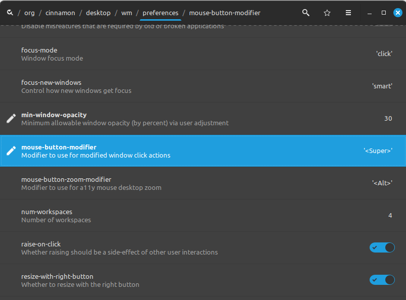
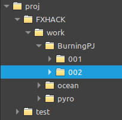
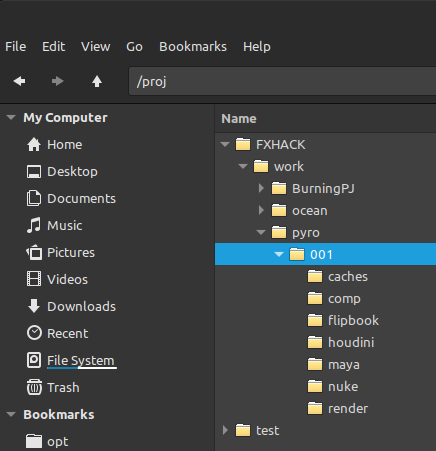
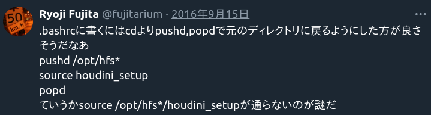
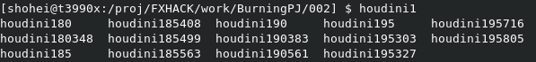
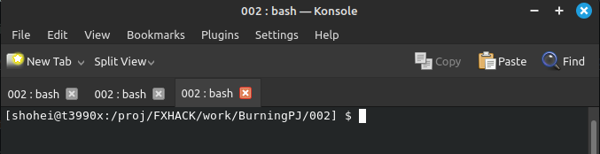
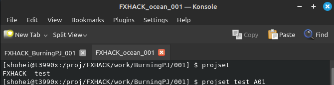

## Windows vs Linux
Googleで「[Houdini Windows vs Linux](https://www.google.com/search?q=houdini+linux+vs+windows)」と調べればいろいろな検証結果がでてきます。


例えば杉村さんのBlogには、シミュレーションの比較があります。  


 

またこちらの動画はMantraとKarmaのレンダリング比較してくれてます。  
  

<span style="font-size: 20px;">**10％ー30％はLinuxのほうが速いですね。**</span>  
にしてもKarmaの速度に大きな差があるのは驚きですね！


## Linuxディストリビューション
Linuxディストリビューションとは、ハードウェアとソフトウェアの間の通信を管理し、システムリソースを効率的に配分してくれるLinuxカーネルに加えて、ソフトウェアやユーティリティ、ユーザーインターフェースなどが組み込まれている、Linuxベースのオペレーティングシステムのバリエーションやバージョンのこと。

ユーザーフレンドリーなUbuntuやLinux Mint、企業向けのRed Hat Enterprise Linux、高度なユーザー向けのArch Linuxなど、多種多様なバリエーションがあります。

VFX/CG業界ではCentOSが主流でした。しかしCentOSが2024年6月30日にサポート終了になる、つまりアップデートやセキュリティパッチの更新がなくなることが発表されました。
ですのでCentOSを使ってた会社はRockyに移行してくとこもあるみたいです。

| ディストリビューション | 特徴 |
| --- | --- |
| Ubuntu | ユーザーフレンドリーで初心者におすすめ。広範なソフトウェアサポート。 |
| Debian | 安定性とセキュリティに重点を置いている。多くのディストリビューションのベース。 |
| Fedora | 最新のテクノロジーを早期に採用。Red Hatによって支援されている。 |
| CentOS | Red Hat Enterprise Linuxをベースにした企業向けの無料ディストリビューション。 |
| Arch Linux | シンプルさとユーザーによる細かなカスタマイズを重視。 |
| Linux Mint | Ubuntuをベースに、使いやすさと美しいデスクトップ環境を提供。 |
| Rocky Linux | CentOSの代替として開発された、企業向けの安定したディストリビューション。 |
| AlmaLinux | CentOSの終了に伴い、そのコミュニティによって作成された無料のエンタープライズ級Linuxディストリビューション。 |


どのディストリビューションを選ぶかは、まず各ソフトのシステム要件をみてみましょう。

- Houdini:  
https://www.sidefx.com/ja/Support/system-requirements
- Nuke:  
https://www.foundry.com/products/nuke-family/requirements
- Unreal Engine:  
https://docs.unrealengine.com/5.3/en-US/hardware-and-software-specifications-for-unreal-engine/
- Blender:  
https://blender.org/download/requirements/
- Maya:  
https://www.autodesk.com/support/technical/article/caas/sfdcarticles/sfdcarticles/System-Requirements-for-Autodesk-Maya-2024.html

やはりRockyを推していってますね。


## Mintをインストール！
### Mintな理由
上記でVFX業界の主流はCentOSからRockyへ、ソフトウェアの対応もRockyに移行してるみたいなのに、なんでMintなのと思われるでしょう。
CentOSやRockyはRedHat系といわれますが、これらは初心者には難しいです。私自身も自宅でCentやFedoraを使ったことがありますが、かなり苦労しました。

ですのでユーザーフレンドリーでソフトウェアのインストールが簡単なDebian系をおすすめします。Debian系はLinuxディストリビューションのシェアランキングが1位なだけあって**コミュニティが大きくトラブルシューティング等の情報に簡単にアクセスできる点がおすすめする一番の理由**です。  あとNvidiaのDriverを簡単にインストール・アップグレードできる点も非常にプラスです。

実際にHoudiniユーザもMintを使ってる人は多い印象です。  
え？Mayaのインストラーが対応していないですって？ちょっと頑張ればインストールできますよ・・・

### デスクトップ環境
まずMintをインストールする前にデスクトップ環境を選ばなければいけません。  
デスクトップ環境とは、グラフィカルユーザーインターフェイス（GUI）を提供するソフトウェアの集合です。これにより、ユーザーはマウスやキーボードを使用してアプリケーションを操作し、ファイルを管理できます。Windowsは選択肢がなくカスタマイズが困難ですが、LinuxではユーザーがGUIの外見や動作を細かく制御できるのが特徴です。以下が代表的なデスクトップ一覧です

| デスクトップ環境 | 特徴 |
| --- | --- |
| GNOME | シンプルでモダンなUI。拡張性が高い。 |
| KDE Plasma | 豊富なカスタマイズオプション。美しいグラフィック。 |
| XFCE | 軽量で高速。古いハードウェアに適している。 |
| LXDE/LXQt | 非常に軽量で、リソースが限られたシステムに最適。 |
| Cinnamon | 使いやすく伝統的なデスクトップ体験を提供。Linux Mintで人気。 |
| MATE | GNOME 2からフォーク。シンプルで使いやすい。 |

カスタマイズ性が高いことから、GUIに凝っていて見づらく感じたり、大量のメモリを消費したりするものもあります。
これはインストールしてから変更できるので、**Windowsルックに近くメモリ消費量の少なくて済むMintが作ってるCinnamonをおすすめ**しています。

### インストール
インストールにはデュアルブートという方法をおすすめします。デュアルブートとは異なるオペレーティングシステム（OS）を同じマシン上にいれることをいいます。これによりWindowsとLinuxの両方の環境を利用できるため、用途に応じて最適なシステムを選択できる柔軟性があります。例えば特定のソフトウェアや開発ツールがLinuxでより良く動作する場合はLinuxを使用し、AdobeのようなLinuxに対応していないソフトはWindowsに切り替えて使用するといったことが可能になります。

インストール方法はネットに溢れてるので探してみてください。



## Mint セットアップ
インストールが終わったら、ソフトインストールしたり設定を変えてみましょう。

### Nvidiaドライバー
ドライバーマネージャー GUIを使用して、ハードウェアに必要なドライバーを簡単に選択/インストールできます。  
まず、これから最初に始めましょう！！滅多にないですがインストールに失敗して画面が映らなくなったら、初心者では治すのが難しいでしょう。クリーンインストールしたほうが速いときがあり全部消してもダメージが最小な時にやるのがおすすめです。

### ソフトウェア
おすすめなソフトは以下のとおりです。Windowsにあるものは結構Mintでも使えます

| ソフトウェア          | カテゴリ          | 説明                                               |
|-------------------|---------------|--------------------------------------------------|
| Firefox           | Webブラウザ       | 高速でプライバシー重視のブラウザ。                               |
| Chrome            | Webブラウザ       | 一般的で拡張性の高いブラウザ。                                   |
| Brave             | Webブラウザ       | プライバシー保護と広告ブロック機能を備えたブラウザ。Youtubeの広告でない                 |
| LibreOffice       | オフィススイート    | 文書作成、スプレッドシート、プレゼンテーションなどが可能な無料オフィススイート。 |
| Shutter           | スクリーンショットツール | 編集機能付きのスクリーンショットツール。                         |
| Simple Screen Recorder | 画面録画ソフト     | シンプルで使いやすい画面録画ソフト。                             |
| Google日本語入力      | 入力メソッド       | Googleが提供する高精度な日本語入力。                             |
| GIMP              | 画像編集ソフト     | 写真の編集や画像の作成に強力なオープンソースソフト。               |
| VLC               | メディアプレイヤー    | さまざまな形式のメディアファイルを再生可能なプレイヤー。             |
| Visual Studio Code | テキストエディタ    | コーディングに適した多機能テキストエディタ。                       |
| Sublime Text      | テキストエディタ    | 高速で機能性に富んだテキストエディタ。プログラミングに最適。         |
| dconf Editor      | システムツール     | GNOMEの設定をグラフィカルに編集するツール。 ||

### 設定
Houdiniとか使ってるAltを押しながら何かをすることがあると思いますが、もしかしたらAltを押しながらマウスを移動させるとウインドウが動きませんか？  
dconfエディターでorg > cinnamon > desktop > wm > preferenceでmouse-button-modifierを\<Super>に変更しましょう
Dconfを使わなくても以下のコマンドをターミナルで実行すれば同じことができます。ちなみにSuperはWindowsボタンのことです。
```shell
gsettings set org.cinnamon.desktop.wm.preferences mouse-button-modifier '<Super>'
```
  

これでWinボタンを押しながら、マウスを動かせばウインドウが動き、AltはHoudini等で使えるようになったと思います。  
Windowsだとわざわざウインドウの端をつかんでウインドウのサイズを変えたりしますが、LinuxだとこのWinボタン押しながらもできるので大変便利です。まじめな話キャッシュやレンダーが速くなる次にこの機能があるからLinux使ってるくらいです。  
 
<video width=50% controls autoplay>
    <source src="img/mouse-button-modifier_sample.mp4" type="video/mp4">
    Your browser does not support the video tag.  
</video>
  

GUIのdconfをつかわなくてもターミナルで設定できるよと前述しましたが、下をコピペしてターミナルで走らせるといくつかの設定を一気に変更できます。会社や個人で新しいマシンを買ったりして共通の設定にしたいときに便利です。  
このサンプルはWindows同様System MonitorをCtr+Shit+Escで起動させたり、Shutterという画面キャプチャソフトにショートカットをあてがっています。

```shell
gsettings set org.cinnamon.desktop.keybindings.media-keys screenshot "[]"
gsettings set org.cinnamon.desktop.keybindings.media-keys screenshot-clip "[]"
gsettings set org.cinnamon.desktop.keybindings.media-keys window-screenshot "[]"
gsettings set org.cinnamon.desktop.keybindings.media-keys window-screenshot-clip "[]"
gsettings set org.cinnamon.desktop.keybindings.media-keys area-screenshot "[]"
gsettings set org.cinnamon.desktop.keybindings.media-keys area-screenshot-clip "[]"

gsettings set org.cinnamon.desktop.keybindings.custom-keybinding:/org/cinnamon/desktop/keybindings/custom-keybindings/custom0/ name "System Monitor"
gsettings set org.cinnamon.desktop.keybindings.custom-keybinding:/org/cinnamon/desktop/keybindings/custom-keybindings/custom0/ command "gnome-system-monitor"
gsettings set org.cinnamon.desktop.keybindings.custom-keybinding:/org/cinnamon/desktop/keybindings/custom-keybindings/custom0/ binding "['<Primary><Shift>Escape']"

gsettings set org.cinnamon.desktop.keybindings.custom-keybinding:/org/cinnamon/desktop/keybindings/custom-keybindings/custom1/ name "Konsole"
gsettings set org.cinnamon.desktop.keybindings.custom-keybinding:/org/cinnamon/desktop/keybindings/custom-keybindings/custom1/ command "konsole"
gsettings set org.cinnamon.desktop.keybindings.custom-keybinding:/org/cinnamon/desktop/keybindings/custom-keybindings/custom1/ binding "['<Control><Alt>k']"

gsettings set org.cinnamon.desktop.keybindings.custom-keybinding:/org/cinnamon/desktop/keybindings/custom-keybindings/custom2/ name "Shutter - Full"
gsettings set org.cinnamon.desktop.keybindings.custom-keybinding:/org/cinnamon/desktop/keybindings/custom-keybindings/custom2/ command "shutter -f"
gsettings set org.cinnamon.desktop.keybindings.custom-keybinding:/org/cinnamon/desktop/keybindings/custom-keybindings/custom2/ binding "['<Control>Print']"

gsettings set org.cinnamon.desktop.keybindings.custom-keybinding:/org/cinnamon/desktop/keybindings/custom-keybindings/custom3/ name "Shutter - Selection"
gsettings set org.cinnamon.desktop.keybindings.custom-keybinding:/org/cinnamon/desktop/keybindings/custom-keybindings/custom3/ command "shutter -s"
gsettings set org.cinnamon.desktop.keybindings.custom-keybinding:/org/cinnamon/desktop/keybindings/custom-keybindings/custom3/ binding "['Print']"

gsettings set org.cinnamon.desktop.keybindings.custom-keybinding:/org/cinnamon/desktop/keybindings/custom-keybindings/custom4/ name "Shutter - Window"
gsettings set org.cinnamon.desktop.keybindings.custom-keybinding:/org/cinnamon/desktop/keybindings/custom-keybindings/custom4/ command "shutter -w"
gsettings set org.cinnamon.desktop.keybindings.custom-keybinding:/org/cinnamon/desktop/keybindings/custom-keybindings/custom4/ binding "['<Shift>Print']"

gsettings set org.cinnamon.desktop.keybindings custom-list "['custom0','custom1','custom2','custom3','custom4']" 
```


## Terminal
ターミナルとはコマンドを実行するアプリケーションです。
Linuxにはいくつかのターミナルがあり、代表的なのもはGnome TerminalとKonsoleです。  
Gnome Terminalは、GNOMEデスクトップ環境の標準ターミナルエミュレータです。Konsoleは、KDEデスクトップ環境のためのターミナルエミュレータです。  
個人的にはKonsoleが見やすいので使っています。

以前の記事でLauncherもどきというものを紹介しましたね。  
[Launcherもどき](/FXHACK/posts/2021-04-29/#おまけlauncherもどき)  
ここで以下のスクリプトを.bashrcに追加すればいいと言いました。


```bash
function projset() {
    export 'PROJ='$1;
    export 'SEQ='$2;
    export 'SHOT='$3;
    export 'HOUDINI_HIP_DEFAULT_NAME='$1'_'$2'_'$3'_FX_ELEMENT_v001.hip';
    cd '/proj/'$1'/work/'$2'/'$3;
}
```

一度基礎をおさらいしましょう。

#### .bashrc
そもそも.bashrcとは、ユーザーのホームディレクトリに置かれ、主にエイリアスや関数の定義、環境変数の設定など、シェルの動作をカスタマイズするために使用されます。
ファイルの場所はユーザー名がshoheiの場合、/home/shohei/.bashrcです。

#### alias（エイリアス）
エイリアスとは、長いコマンドやよく使うコマンドの短縮形として設定することができます。これにより、タイピングの手間を省き、作業の効率化を図ることができます。

### projset
上記のスクリプトはprojsetという関数を定義しています。  
3つの引数（$1=プロジェクト名、$2=シーケンス名、$3=ショット名）を受け取って、その対象Shotフォルダまで移動する関数です。 
```bash
function projset() {
    # 引数を使用して、PROJ、SEQ、SHOTという環境変数を設定します。
    export 'PROJ='$1;
    export 'SEQ='$2;
    export 'SHOT='$3;
    # HOUDINI_HIP_DEFAULT_NAMEという環境変数を設定します。これはHoudini内においてデフォルトのシーンファイル名を形成します
    export 'HOUDINI_HIP_DEFAULT_NAME='$1'_'$2'_'$3'_FX_ELEMENT_v001.hip';
    # cdコマンドを使用して、ユーザーが作業する特定のディレクトリに移動します。このディレクトリパスは/proj/[プロジェクト名]/work/[シーケンス名]/[ショット名]となります。
    cd '/proj/'$1'/work/'$2'/'$3;
}
```
前回はここまででした。本線とずれるのでこの先は書きませんでした。もう少し便利にしていきましょう。
例えばプロジェクトが**FXHACK**でシーケンスが**BurningPJ**ショットが**002**のとき、タイプ入力していくのがめんどいしスペルミスすることもあります。  
 
<video width=50% controls autoplay>
    <source src="img/projset_02.mp4" type="video/mp4">
    Your browser does not support the video tag.  
</video>
  
そこで、このプロジェクトやショットをタイプするときにリストしてもらったり補間してくれる機能を搭載してみましょう。

#### .bash_completion
これは、Bashシェルでコマンドライン操作の効率を高めるための機能の一つです。具体的には、コマンド名、オプション、ファイル名などの入力時に、タブキーを押すことで自動的に補間候補を表示してくれる機能です。この機能により、ユーザーはコマンドの入力を速く、正確に行うことができます。

.bashrcと同じ場所にファイルがあります。私の場合だと/home/shohei/.bash_completionにあります。ない場合は作ってください。このファイルに以下の記述を追加します。
```bash
projSubDirCompletion(){
  # Retrieve the current word, the previous word, and the position of the current word
  local cur prev cword
  _get_comp_words_by_ref -n : cur prev cword
  
  # Processing for the first argument
  if [ "${cword}" -eq 1 ]; then
    # Provide subdirectories within /proj directory as completion candidates
    COMPREPLY=( $(compgen -W "$(find /proj -maxdepth 1 -mindepth 1 -type d -printf '%f\n' | grep -v '^[.#]')" -- $cur) )   

  # Processing for the second argument
  elif [ "${cword}" -eq 2 ]; then
    # Provide 'work' subdirectories within the directory selected as the first argument as completion candidates
    COMPREPLY=( $(compgen -W "$(find /proj/${prev}/work -maxdepth 1 -mindepth 1 -type d -printf '%f\n' | grep -v '^[.#]')" -- $cur) )

  # Processing for the third argument
  elif [ "${cword}" -eq 3 ]; then
    # Provide completion candidates based on the paths specified in the first and second arguments
    local pprev="${COMP_WORDS[COMP_CWORD-2]}"
    COMPREPLY=( $(compgen -W "$(find /proj/${pprev}/work/${prev} -maxdepth 1 -mindepth 1 -type d -printf '%f\n' | grep -v '^[.#]')" -- $cur) )

  fi
} &&
complete -F projSubDirCompletion projset
complete -F projSubDirCompletion projsetmakedir
```

これによりTabキーを押していくと候補がでたり自動補間してくれます。  
 
<video width=50% controls autoplay>
    <source src="img/projset_03.mp4" type="video/mp4">
    Your browser does not support the video tag.  
</video>

  

#### projsetmakedir

なかなかいい感じになってきましたね。そもそもこのフォルダ構造を新しいプロジェクトやショット毎に作るのは面倒ですね。  
それも作りましょう。以下のスクリプトを.bashrcに追加します。

```bash
function projsetmakedir() {
    root='/proj/'$1'/';
    folder=$root'/work/'$2'/'$3'/'; 
    mkdir -p $folder'houdini' $folder'nuke' $folder'caches' $folder'render' $folder'comp' $folder'flipbook' $folder'maya';
    projset $1 $2 $3;
}

```

新しいフォルダを作りたければTerminalでタイプすればフォルダができます。
```bash
projsetmakedir FXHACK pyro 001
```
  

#### ソフトウェア起動
作業したいショットのフォルダまで簡単に移動できるようになったので、次はソフトを立ち上げます。
HoudiniはWindowsの場合、起ち上げるとConsoleウインドウも出てきて、そこにエラー内容やログが表示されます。LinuxにはそれがないのでTerminalから起動するのよいです。

HoudiniをTerminalから起動する方法をみてみましょう。

https://www.sidefx.com/faq/question/how-do-i-set-up-the-houdini-environment-for-command-line-tools/  
インスールフォルダに移動してsource houdini_setupを実行し、起動となっています。

```
cd /opt/hfs19.5.xxx
source houdini_setup
houdini
```
これだとせっかくprojsetでShotフォルダに移動したのに、houdiniフォルダに移動しています。
ここでレジェンドの最適解をみてみましょう。
 
https://x.com/fujitarium/status/776255138260357121?s=20
```
pushd /opt/hfs*
source houdini_setup
popd
```
これでインスール先に移動しなくなりました。ありがとうございます。

うまくいったところでaliasをバージョンごとに作ってみましょう。これを.bashrcに保存してもいいですし、わかりやすくするため.bash_aliasesに書いてもOKです。
Nukeもつくってもいいでしょう。

```bash
alias houdini195='pushd /opt/hfs19.5;source houdini_setup;popd;houdini;'
alias houdini195303='pushd /opt/hfs19.5.303;source houdini_setup;popd;houdini;'
alias houdini195327='pushd /opt/hfs19.5.327;source houdini_setup;popd;houdini;'
alias houdini195716='pushd /opt/hfs19.5.716;source houdini_setup;popd;houdini;'

alias nuke120='/usr/local/Nuke12.0v6/Nuke12.0 --disable-nuke-frameserver'
alias nuke121='/usr/local/Nuke12.1v5/Nuke12.1 --disable-nuke-frameserver'
```

 

### 複数タブ
 
複数ショットを同時に作業するときは、タブごとにprojsetをしてソフトを起動するほうが効率がいいですね。
しかしタブをみると、どのシーケンスのショットなのかわかりにくいです。  
.bashrcを少し編集しましょう。

```bash
export TITLEBAR='\[\e]0;[${PROJ}_${SEQ}_${SHOT}]\a\]'
PS1="[${TITLEBAR}\u@\h:\w] $ "

function projset() {
    export 'PROJ='$1;
    export 'SEQ='$2;
    export 'SHOT='$3;
    export 'PROJ_ROOT=/WORK/proj/'$1;
    export 'JOB=/WORK/proj/'$1'/shot/'$2'/'$3;
    export 'HOUDINI_HIP_DEFAULT_NAME='$1'_'$2'_'$3'_FX_ELEMENT_v01.001.hip';
    cd '/proj/'$1'/work/'$2'/'$3'/';
    echo -ne "\033]30;${PROJ}_${SEQ}_${SHOT}\007"
}
```


これはGnome Terminal向けのおまじないです。PROJ・SEQ・SHOTの環境変数がセットされたら自動でタブ名が変わります。
```bash
export TITLEBAR='\[\e]0;[${PROJ}_${SEQ}_${SHOT}]\a\]'
PS1="[${TITLEBAR}\u@\h:\w] $ "
```

こっちはKonsole用です。
```bash
echo -ne "\033]30;${PROJ}_${SEQ}_${SHOT}\007"
```
 

わかりやすくなりましたね！
ここまで少しは理解していただけでしょうか？自分の環境に合わせて改造してみてください。


## Linuxをスタンダードに
Windowsで仕事するなんてありえないとか言ってきましたが、ただ吠えててもしょうがないので、導入編を書いてみました。まずは個人レベルでユーザーが増えていく助けになればと思います。

特に学生や若い人にとって、家で自主制作やRnDをするときは同じワークステーションで10％速くなるならありがたいことだと思います。是非チャレンジしてみてください。  
またLinuxがベースの会社ならツールやソフトを立ち上げるとき、ランチャーでなくてTerminalから起ち上げることが多いでしょう。海外を目指してる人は日頃からLinuxとTerminalに慣れておいて損はないです。

ほんとに残念ながら日本の会社はWindowsばかりです。

Linuxにするとソフトの起動も速くなります。特に大手だとたくさんのプラグイン等を起動時に読み込む必要があります。ひどい場合だとWindowsよりLinuxのほうが3分速く起ち上がるということはよくあります。  
サーバーに100タスク投げててたら、1タスク3分のロスつまり100タスク300分消費されます。5時間あったら他のレンダーが何フレーム回りますか？  100タスクは多いでしょうか？100フレームの爆発Shotがあったら、シミュレーションタスクが1つ、Post処理してVDBにベイクするために5フレずつで20タスク、レンダーするまえにUSDを書き出すために10タスクとしても31タスクです。100タスクはあっという間です。これに加えてシムやレンダースピードもあがります。これだけのコスト削減以上のことをどうやってやりますか？

サーバーだけでもLinuxにする価値は十分あります。

Adobeがとか言いたいでしょうが、デュアルブートにするかWindowsの共有マシンを設置すれば解決する可能性もあります。モデラーはWindowsしかないソフトを多用しなければいけないため、Linuxメインは難しいかもしれません。しかし、それ以降の工程はLinuxで全く問題ないですよね？

