# 
皆さんはアウトソーシング先や他のベンダー会社にデータを共有する際、どのような手法を取っていますか？

Houdiniならキャッシュやテクスチャをシーンファイルがある同じ階層に置いて、それぞれのファイルパスを$HIP始まりにする。もしくはLocal Variables $JOBを用いてファイルの保存場所を指定し、異なる環境で開いた際には作業者が変数の値を更新するのが一般的です

Nukeにおいては、Nukepediaや社内で開発したGathering toolを利用して、シーン内のRead/Writeノードが参照するファイルパスのデータを他の場所にコピーし、それらのノードのファイルパスを相対パスに変更することが多いです。

では、USDを使う場合はどのように対応すればよいでしょうか？今回はPDGを使った話をしていきます。

Sample File(20.5.410 py3.11): https://drive.google.com/file/d/1pkv1pYyNRrdOpoF50qxvsBc3HxAFyi5r/view?usp=drive_link


## USDアセット作成
まずSolarisで簡単なデータを作るとこから始めます。

もうUSDは日本以外のとこではスタンダードになったと言っても過言ではないフォーマットです。ですので、簡単な説明は省きます。

アセットを作ったことがない人は、このチュートリアルを見てください。
https://www.sidefx.com/tutorials/usd-asset-building-with-solaris/


### Component
まずCompoent Builderを使って、2つのComponent、GridとVariantをもったRocksをつくります。

Component Outputの出力先を、今後の説明を分かりやすくするために以下のように変更しておきます。
それぞれ、Save to Diskを押して、USDを作成します。
```
$HIP/usd/components/`chs("name")`/v001/`chs("filename")`
```

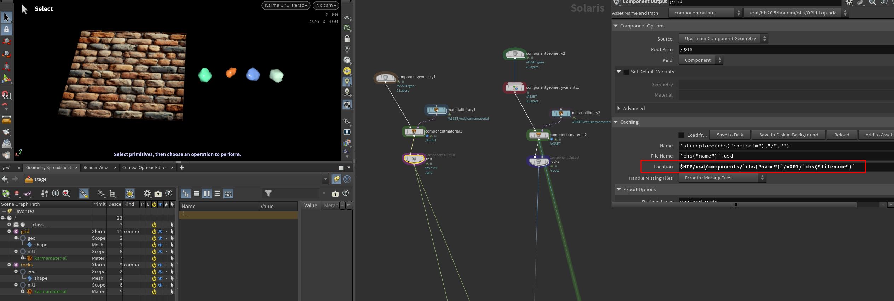  

保存先を見てみると、このようなフォルダ構造になっているかと思います。
```
└── usd/
    └── components/
        └── grid/
            └── v001/
                └── grid.usd
                └── geo.usdc
                └── mtl.usdc
                └── payload.usdc
                └── textures/
                    └── bricks001_basecolor.png
        └── rocks/
            └── v001/
                └── rocks.usd
                └── geo.usdc
                └── mtl.usdc
                └── payload.usdc
```
Gridはテクスチャは持っており、そのテクスチャは$HIP/texturesに保存してありましたが、usdが保存されているtexturesフォルダにコピーされています。
そして、GridというComponentのUsdを読み込んでみると、テクスチャパスは@./textures/bricks001_basecolor.png@になっています。絶対パスではなくでなく、相対パスになっています。

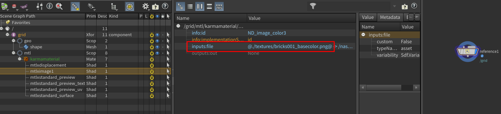  

Referenceで読み込んでるgrid.usdの中身にも相対パスが使われています
```
#usda 1.0
(
    defaultPrim = "grid"
    framesPerSecond = 24
    metersPerUnit = 1
    timeCodesPerSecond = 24
    upAxis = "Y"
)

def Xform "grid" (
    prepend apiSchemas = ["GeomModelAPI"]
    assetInfo = {
        asset identifier = @./grid.usd@
        string name = "grid"
        asset thumbnail = @./thumbnail.png@
    }
    prepend inherits = </__class__/grid>
    kind = "component"
    prepend payload = @./payload.usdc@
)
{
    float3[] extentsHint = [(-5, 0, -5), (5, 0, 5)]
}

class "__class__"
{
    class "grid"
    {
    }
}
```
これらはComponent Outputのなかにあるropの**Output Processing**にて、処理がされています。
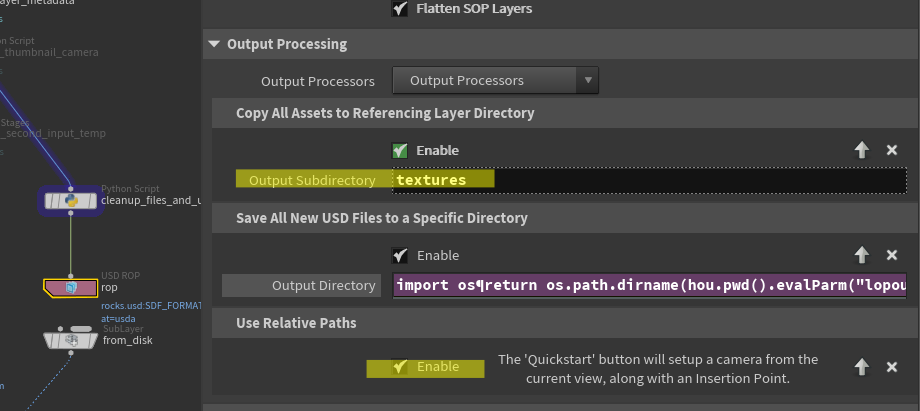  

ここの説明は、こちらで丁寧に説明されていますので、読んでみてください。
https://fereria.github.io/reincarnation_tech/houdini/solaris/output_processor


テクスチャはコピーされ、すべてが相対パスになっているということは、.usdがある上のフォルダを別の場所に移して、それを開いたとき正常に動作しますね。
これがとても重要なことです。 ただComponent Builderを仕事で使うかは大きな議論の余地がありますが、とりあえず他のやり方でも相対パスでやるべきだと思います。

### Assembly
続いてAssemblyを作ります。前で作ったComponentを２つ読み込み、RockはInstanceして、Gridと合わせてWallというAssemblyにします。
作り方は以下のガイドラインに沿ってやります。

**USD Asset Building with Solaris 6 | Asset Structure Guidelines**
 https://vimeo.com/814276750

 AssemblyをつくるNodeを公式が用意してくれてもいいと思うんですよね・・・

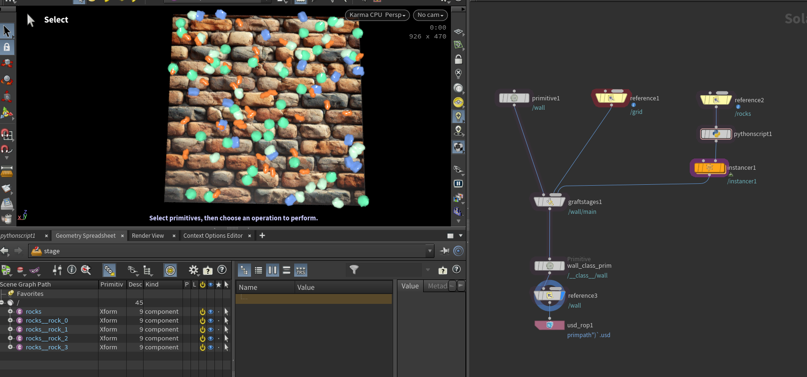  
こんな感じになりました。
書き出し先を、このように設定しました。
```
$HIP/usd/assembly`chs("../primitive1/primpath")`/v001`chs("../primitive1/primpath")`.usd
```
保存するとフォルダ構成は、このようになりました。

```
└── usd/
    └── components/
        └── grid/
            └── v001/
                └── grid.usd
                └── geo.usdc
                └── mtl.usdc
                └── payload.usdc
                └── textures/
                    └── bricks001_basecolor.png
        └── rocks/
            └── v001/
                └── rocks.usd
                └── geo.usdc
                └── mtl.usdc
                └── payload.usdc
    └── assembly/
        └── wall/
            └── v001/
                └── wall.usd
```

これで一旦テストデータの構築は終わりです。

## PDG
前置きが長くなりましたが、本題に入りましょう。

### USD Analyze TOP
WallというAssemblyを送りたい場合、まずAssemblyの中に何が入っているかを知る必要があります。現状はこうなっていますね。
```text
└── (Assembly) wall: v001
    └── (component) grid: v001
    └── (component) rocks: v001
```
ですので、`usd/assembly/wall/v001`と`usd/components/grid/v001`と`usd/components/rocks/v001`のフォルダを階層構造を保持したまま、別のところへコピーして、これを送れば良いということです。

PDGで、USDの中身を見るにはUSD Analyzeを使います
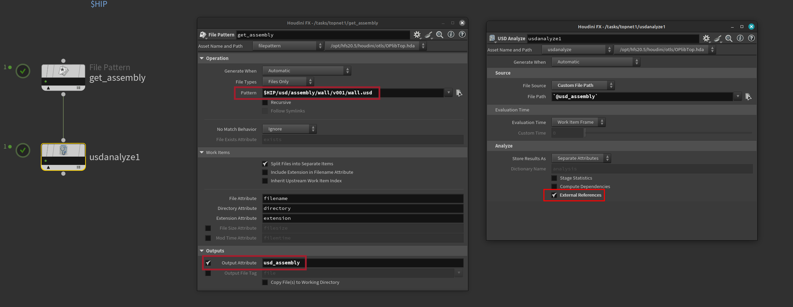  
USD AnalizeのExternal ReferenceをOnにすることで、このように参照しているリストが取得できます。
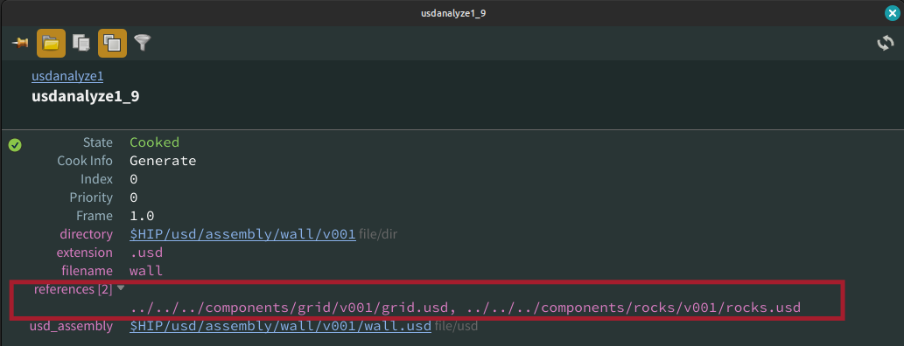  
これは、Scene Graph Layersで、こう見えているところですね。
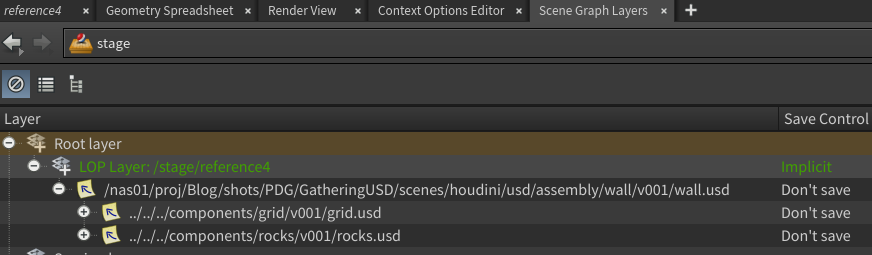 
そしてUSD AnalizeのCompute DependenciesをOnにすると、すべての依存関係リストを取得できます。
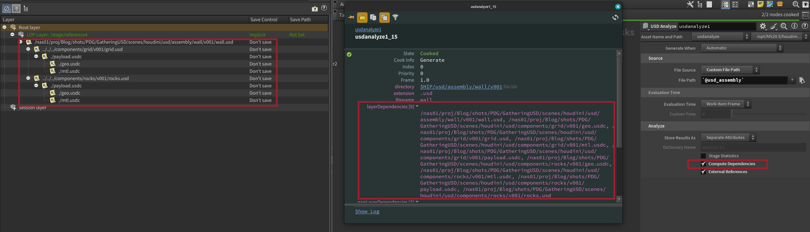 

今回はCompute Dependenciesを使います。

いまPDGにはWorkItemが1つしかありません。`usd/assembly/wall/v001`と`usd/components/grid/v001`と`usd/components/rocks/v001`このフォルダをそれぞれコピーするので、３つのWorkItemが必要になります。そこで、layerDependenciesから、移動するべきフォルダを取り出します。いくつかのusdは同じフォルダに入っているため、重複するフォルダは1つにします。この処理はPython Proccessorで行います。
```python
import os

for upstream_item in upstream_items:    
    
    folders = []
    layerDependencies = upstream_item['layerDependencies']
    
    for ld in layerDependencies:
        fld = os.path.dirname(ld)
        if not fld in folders:
            folders.append(fld)
            
    for folder in folders:
        new_item = item_holder.addWorkItem(parent=upstream_item)
        new_item.setFileAttrib("usd_folder", pdg.File(folder, "file/dir", 0, True))
        new_item.setFileAttrib("usd_folder_parent", pdg.File(os.path.dirname(folder), "file/dir", 0, True))

```
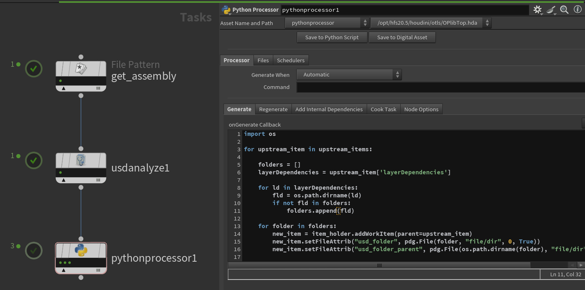 

### Gather
データを収集する前に、収集する場所を設定しましょう。よくあるのはfromToというフォルダのToフォルダのなかに、今日の日付フォルダを作って、その中にデータをコピーするのが一般的ですかね？今回は`$HIP`の上階層に`fromTo`フォルダをつくります。

PDGでやるには、Pythonでまず現在の日付のStringアトリビュートをつくります。そしてコピー先のフォルダをアトリビュート(`@dir_to`)をつくります。
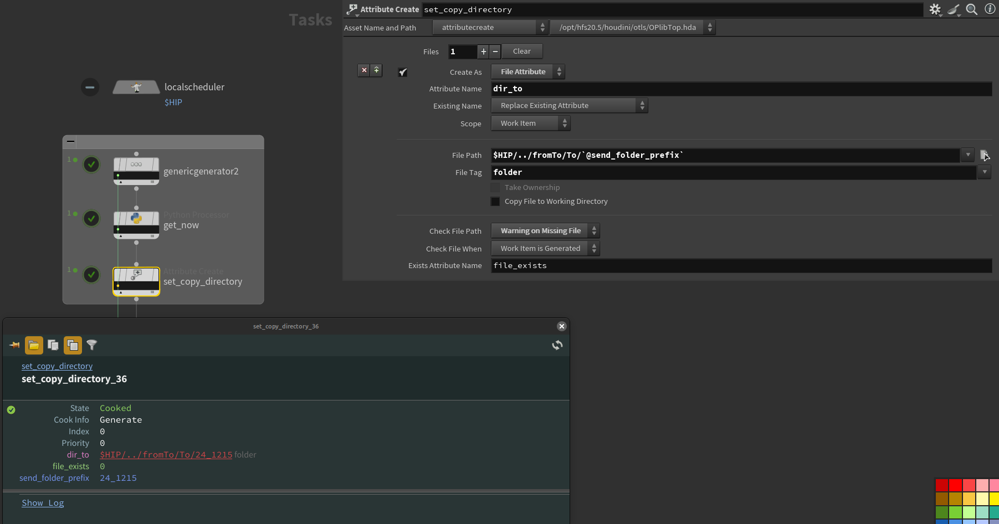 

このノード群を先程のノード群の上につなぎ、一番下にFile Copyノードをつなぎます。
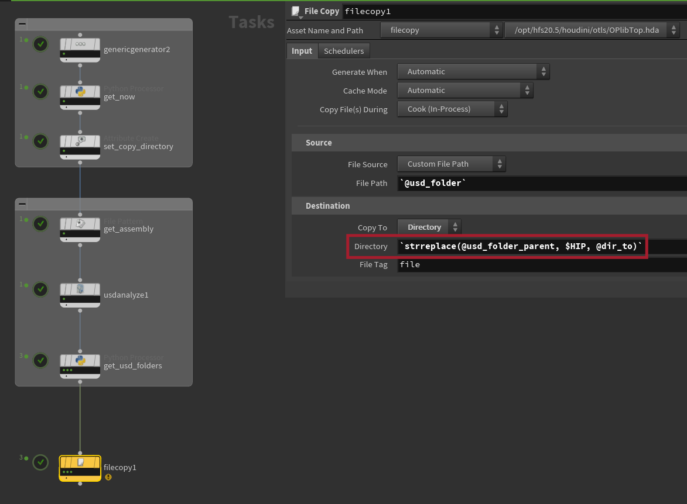 
DestnaitionのDirectoryには`strreplace(@usd_folder_parent, $HIP, @dir_to)`と$HIPを@dir_toに置き換えていますが、実際の仕事で使う場合、各自USD保存先を指定するなのど工夫してください。

File Copyを実行すると、指定のところにコピーされました。このような感じになりましたね。
```
└── To/
    └── 24_1215/
        └── usd/
            └── assembly/
                └── wall/
                    └── v001/
                        └── wall.usd
            └── components/
                └── grid/
                    └── v001/
                        └── grid.usd
                        └── geo.usdc
                        └── mtl.usdc
                        └── payload.usdc
                        └── textures/
                            └── bricks001_basecolor.png
                └── rocks/
                    └── v001/
                        └── rocks.usd
                        └── geo.usdc
                        └── mtl.usdc
                        └── payload.usdc
```
24_1215というフォルダを圧縮して、相手方に送ればいいだけです。
もちろんPDGにはFile Compress Topを使って、Zipファイルを作ることができますが、個人的にはコピーされたものを確認してから、圧縮するのが良いと思っているので、ここまでにしておきます。

基本的流れは、これで終わりです。

### Assembly更新
続いて、USDを送ったあと何かしらの更新があり、その更新を送るときのことについて考えます。

ここではComponentのgridを更新して、Assemblyもそれに伴いバージョン上げたとします。WallというAssemblyの構成はこのように更新されました。

```diff
+└── (Assembly) wall: v002
+    └── (component) grid: v002
     └── (component) rocks: v001
```
この更新を相手方と共有する際、rockには変更がないため、wall:v002とgrid:v002を送ればいいですね。ということは、こっちでは前回送ったものと今回送るものの差分を見つけ出す作業が必要です。もちろんPDGでやります。

前に作ったAssemblyの中に何が入っているかを知るノード群を複製し、今回送るバージョンと前回送ったバージョンの中身を調べます。新しい方にはnewというアトリビュートをつくり値を1にしておきます。古い方は値は0です。そして新旧をマージします。こんな感じのネットワークになりました。

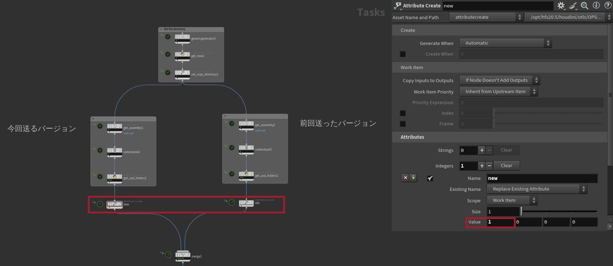 

続いて、差分を取り出します。現在各USDがWorkItemになっているため、新旧あわせて6つあります。今回送る差分は2つなので、2つのWorkItemを取り出します。

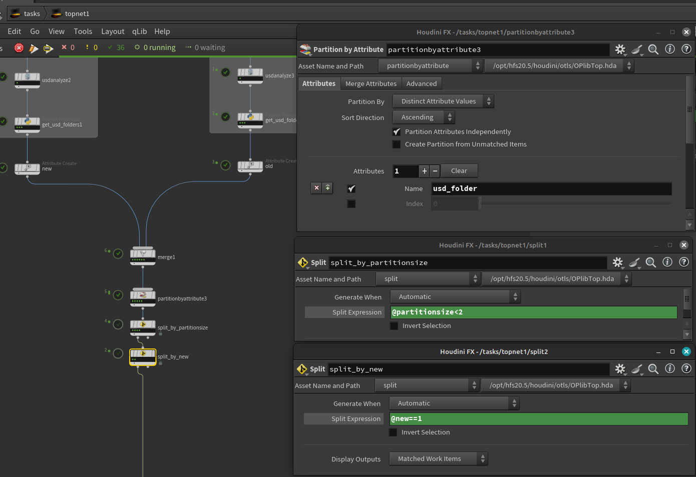 

まずPartation by Attributeで、同じ@usd_folderの値をもったWorkItemも１つにします。@usd_folderはusdファイルが入ってるフォルダです。今回は`$HIP/usd/components/grid/v002`のようになっています。  このノードは、@partitionsizeアトリビュートを作ります。これは何個をまとめたかを教えてくれます。  
WorkItemは6から5になりました。これは新旧どちらにもrocks: v001があるため、それらが1つになったからです。

split_by_partitionsizeで`@partitionsize<2`として、重複しているもの(rocks:v001)を削除しました。  
この時点でのWorkItemには、wall:v002とgrid:v002とwall:v001とgrid:v001が入っています。

split_by_newにて、新しい方のみを残すようにしています。これで送りたい2つのWorkItemを抽出できました。

最後に、File Copyで差分を目的の場所(24_1216)にコピーします。
```
    └── 24_1215/
        └── usd/
            └── assembly/
                └── wall/
                    └── v001/
                        └── wall.usd
            └── components/
                └── grid/
                    └── v001/
                        └── grid.usd
                        └── geo.usdc
                        └── mtl.usdc
                        └── payload.usdc
                        └── textures/
                            └── bricks001_basecolor.png
                └── rocks/
                    └── v001/
                        └── rocks.usd
                        └── geo.usdc
                        └── mtl.usdc
                        └── payload.usdc
    └── 24_1216/
        └── usd/
            └── assembly/
                └── wall/
                    └── v002/
                        └── wall.usd
            └── components/
                └── grid/
                    └── v002/
                        └── grid.usd
                        └── geo.usdc
                        └── mtl.usdc
                        └── payload.usdc
                        └── textures/
                            └── bricks001_basecolor.png
```

ちゃんと更新分だけがコピーされています。あとは受けっとた人が、前回送ったものと同じフォルダに入れてくれれば終わりです。


### おまけ
さっきからフォルダ構成のテキストがありますが、もちろんこれもPDGで作っています。
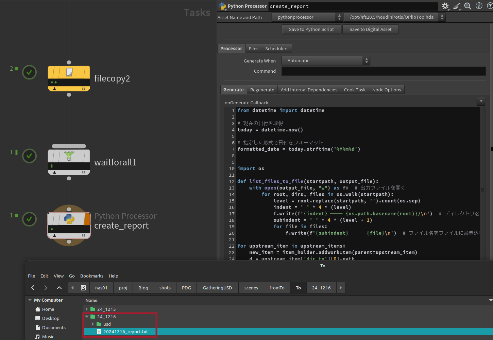 
これで作ったreport.txeを相手方へ一緒に送ることによって、このテキストを開けば何が入っているかを知ることが簡単になるのと、FTPなどで圧縮せずに送ったときに送信エラーか何かで歯抜けになったものを確認できるかもしれません。

## まとめ
今回は話をシンプルにするために1つのアセットのみで話をしましたが、複数アセットがあって、それをまとめたショットのUSDを送るみたいなときのように、どんな階層が深くなったとしても動きます。

またComponent Builderを使うことを前提に話しました。差分だけ送ると言いましたが、テクスチャは同じものを2度送っていますね。今回はとても簡単なアセットなので問題ないですが、仕事では厳しくなるはずです。こういうこともあってHoudiniHive等で自社のWorkflowを紹介しているときComponentBuilderを見かけないのは、このような理由も1つのうちだと思っています。MaterialだけのUSDを作ってやればいいのですが、このあたりも公式がサポートしてほしいものです。

なにはともあれ、USDとPDGの組み合わせは便利だと思いませんか？USDを使うことによって、より他社とのデータ共有が楽になるはずです。  
私自身も昔会社を作ったのでどの口が言うのかですが、日本には小さい会社が多すぎます。CMやると馬鹿みたいにいろんな会社に仕事をふって、学生が作ったような汚いデータがくることもたまにありますね。多くの無駄な時間を過ごしたことがあるでしょう。

個人的な見解として、日本のように1つのプロジェクトで多数の会社とデータを共有する必要がある場合、USDの採用が非常に有効だと考えています。本記事を通じて、データ共有の容易さを感じていただき、より多くの企業がUSDへの移行を検討していただけることを願っています。そして今後仕事を振る側の会社はUSDベースになってもらい、USD使えない下請け会社には仕事を振る機会が減るくらいになってほしいです。